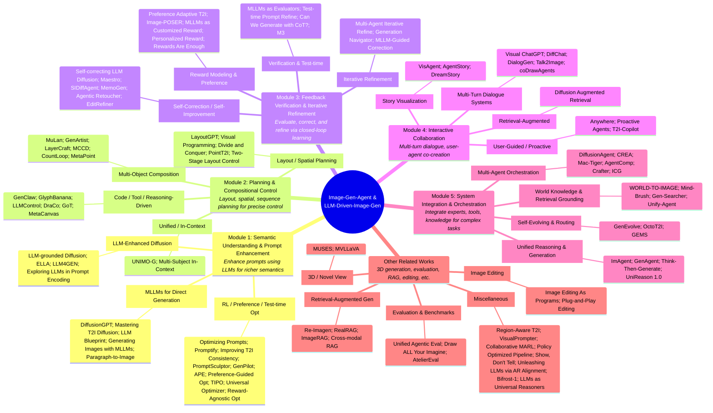

# Awesome-agentic-visual-generation-model
# A Survey on Visual Generation Agents

A curated list of research papers and open-source resources for Agentic and LLM-driven/guided Text-to-Image (T2I) generation and editing.

---

## 📅 News
* **[2026/06]** Updated newly released papers from mid-2026 (e.g., APE, GenClaw, MetaPoint).
* **[2025/12]** Structured the repository to categorize prompt engineering, planning, verification, and orchestration.

---

## Part 1 : Image Gen Agents & LLM-Driven Image Gen

### Mind Map：

### 📌 Table of Contents

* [Module 1: Semantic Understanding and Prompt Enhancement](#module-1-semantic-understanding-and-prompt-enhancement)
* [Module 2: Planning and Compositional Control](#module-2-planning-and-compositional-control)
* [Module 3: Feedback Verification and Iterative Refinement](#module-3-feedback-verification-and-iterative-refinement)
* [Module 4: Interactive Collaboration](#module-4-interactive-collaboration)
* [Module 5: System Integration and Orchestration](#module-5-system-integration-and-orchestration)
* [Other Related Works](#other-related-works)

---

### Module 1: Semantic Understanding and Prompt Enhancement

This module covers works utilizing Large Language Models (LLMs) to expand, optimize, and enhance input prompts for richer semantic understanding.

| Title & Authors | Paper | Github | Website | Venue & Date |
| :--- | :---: | :---: | :---: | :---: |
| **[Optimizing Prompts for Text-to-Image Generation](https://arxiv.org/abs/2212.09681)**   *Y. Hao, Z. Chi, L. Dong, F. Wei* |  |  | - | NeurIPS, 2023 |
| **[Promptify: Text-to-Image Generation through Interactive Prompt Exploration with LLMs](https://arxiv.org/abs/2304.09337)**   *S. Brade, B. Wang, M. Sousa, S. Oore, T. Grossman* |  |  | - | arXiv, 2023 |
| **[LLM-grounded Diffusion: Enhancing Prompt Understanding of Text-to-Image Diffusion Models with LLMs](https://arxiv.org/abs/2305.13655)**   *L. Lian, B. Li, A. Yala, T. Darrell* |  |  | - | arXiv, 2023 |
| **[Improving Text-to-Image Consistency via Automatic Prompt Optimization](https://arxiv.org/abs/2403.17804)**   *O. Manas et al.* |  | - | - | arXiv, 2024 |
| **[DiffusionGPT: LLM-Driven Text-to-Image Generation System](https://arxiv.org/abs/2401.10061v1)**   *J. Qin et al.* |  |  | - | arXiv, 2024 |
| **[Mastering Text-to-Image Diffusion: Recaptioning, Planning, and Generating with Multimodal LLMs](https://arxiv.org/abs/2401.11708)**   *L. Yang et al.* |  | - | - | arXiv, 2024 |
| **[LLM Blueprint: Enabling Text-to-Image Generation with Complex and Detailed Prompts](https://arxiv.org/abs/2310.10640)**   *H. Gani et al.* |  | - | - | ICLR, 2024 |
| **[PromptSculptor: Multi-Agent Based Text-to-Image Prompt Optimization](https://arxiv.org/abs/2509.12446)**   *D. Xiang et al.* |  | - | - | EMNLP Demo, 2025 |
| **[GenPilot: A Multi-Agent System for Test-Time Prompt Optimization in Image Generation](https://arxiv.org/abs/2510.07217)**   *W. Ye et al.* |  | - | - | arXiv, 2025 |
| **[APE: Agentic Prompt Enhancer for Image Generation and Editing](https://arxiv.org/abs/2606.00204)**   *Z. Huang et al.* |  | - | - | arXiv, 2026 |
| **[Preference-Guided Prompt Optimization for Text-to-Image Generation](https://arxiv.org/abs/2602.13131)**   *Z. Li, Y.-C. Liao, C. Holz* |  |  | - | CHI, 2026 |
| **[TIPO: Text to Image with Text Pre-sampling for Prompt Optimization](https://openreview.net/forum?id=dDnw3Pp70x)**   *S.-Y. Yeh et al.* |  | - | - | ICLR, 2026 |
| **[Generating Images with Multimodal Language Models](https://arxiv.org/abs/2305.17216)**   *J. Y. Koh, D. Fried, R. Salakhutdinov* |  | - | - | arXiv, 2023 |
| **[ELLA: Equip Diffusion Models with LLM for Enhanced Semantic Alignment](https://arxiv.org/abs/2403.05135)**   *X. Hu et al.* |  |  | - | NeurIPS, 2024 |
| **[Exploring the Role of Large Language Models in Prompt Encoding for Diffusion Models](https://proceedings.neurips.cc/paper_files/paper/2024/hash/d68c1d10957c8d21ed9dea209533c5a4-Abstract-Conference.html)**   *B. Ma et al.* |  | - | - | NeurIPS, 2024 |
| **[LLM4GEN: Leveraging Semantic Representation of LLMs for Text-to-Image Generation](https://arxiv.org/abs/2407.00737)**   *M. Liu et al.* |  | - | - | arXiv, 2024 |
| **[Paragraph-to-Image Generation with Information-Enriched Diffusion Model](https://arxiv.org/abs/2311.14284)**   *W. Wu et al.* |  | - | - | arXiv, 2023 |
| **[Universal Prompt Optimizer for Safe Text-to-Image Generation](https://arxiv.org/abs/2412.03541)**   *X. Zhang et al.* |  | - | - | arXiv, 2024 |
| **[Reward-Agnostic Prompt Optimization for Text-to-Image Diffusion Models](https://arxiv.org/abs/2506.16853)**   *S. Kim, Y. Cha, J. Yoo, S. Hong* |  | - | - | arXiv, 2025 |

[⬆ Back to Top](#-table-of-contents)

---

### Module 2: Planning and Compositional Control

Focuses on using agents and LLMs to perform spatial, layout, and sequence planning, achieving precise semantic and regional control over image composition.

| Title & Authors | Paper | Github | Website | Venue & Date |
| :--- | :---: | :---: | :---: | :---: |
| **[LayoutGPT: Compositional Visual Planning and Generation with Large Language Models](https://arxiv.org/abs/2305.15393)**   *W. Feng et al.* |  |  |  | NeurIPS, 2023 |
| **[Visual Programming for Text-to-Image Generation and Evaluation](https://arxiv.org/abs/2305.15328)**   *J. Cho and A. Kembhavi* |  |  |  | NeurIPS, 2023 |
| **[Divide and Conquer: Language Models can Plan and Self-Correct for Compositional Text-to-Image Generation](https://arxiv.org/abs/2401.15688)**   *Z. Wang et al.* |  | - | - | arXiv, 2024 |
| **[MuLan: Multimodal-LLM Agent for Progressive and Interactive Multi-Object Diffusion](https://arxiv.org/abs/2402.12741)**   *S. Li et al.* |  |  |  | arXiv, 2024 |
| **[GenArtist: Multimodal LLM as an Agent for Unified Image Generation and Editing](https://arxiv.org/abs/2407.05600)**   *Z. Wang et al.* |  | - |  | arXiv, 2024 |
| **[LayerCraft: Enhancing Text-to-Image Generation with CoT Reasoning and Layered Object Integration](https://arxiv.org/abs/2504.00010)**   *Y. Zhang, J. Li, and Y.-W. Tai* |  |  | - | arXiv, 2025 |
| **[MCCD: Multi-Agent Collaboration-based Compositional Diffusion for Complex Text-to-Image Generation](https://arxiv.org/abs/2505.02648)**   *M. Li et al.* |  | - | - | arXiv, 2025 |
| **[LLMControl: Grounded Control of Text-to-Image Diffusion-based Synthesis with Multimodal LLMs](https://arxiv.org/abs/2507.19939)**   *J. Wang, R. Chen, and H. Cui* |  | - | - | arXiv, 2025 |
| **[CountLoop: Training-Free High-Instance Image Generation via Iterative Agent Guidance](https://arxiv.org/abs/2508.16644)**   *A. Mondal et al.* |  | - |  | arXiv, 2025 |
| **[GenClaw: Code-Driven Agentic Image Generation](https://arxiv.org/abs/2605.30248)**   *J. Ye et al.* |  |  | - | arXiv, 2026 |
| **[GlyphBanana: Advancing Precise Text Rendering Through Agentic Workflows](https://arxiv.org/abs/2603.12155)**   *Z. Yan et al.* |  |  | - | arXiv, 2026 |
| **[MetaPoint: Unlocking Precise Spatial Control in Agentic Visual Generation](https://arxiv.org/abs/2606.05031)**   *D. Zhou et al.* |  | - | - | arXiv, 2026 |
| **[UNIMO-G: Unified Image Generation through Multimodal Conditional Diffusion](https://arxiv.org/abs/2401.13388)**   *W. Li, X. Xu, J. Liu, and X. Xiao* |  | - | - | ACL, 2024 |
| **[PointT2I: LLM-based Text-to-Image Generation via Keypoints](https://arxiv.org/abs/2506.01370)**   *T. Lee, D. Lee, and M. Kang* |  | - | - | arXiv, 2025 |
| **[A Two-Stage System for Layout-Controlled Image Generation using Large Language Models and Diffusion Models](https://arxiv.org/abs/2511.06888)**   *J.-H. Koch, J. Krumme, and K. Gadzicki* |  | - | - | arXiv, 2025 |
| **[Multimodal Large Language Models for Multi-Subject In-Context Image Generation](https://arxiv.org/abs/2604.07422)**   *Y. Zhou, D. Chen, H. Zheng, and J. Shen* |  | - | - | arXiv, 2026 |
| **[DraCo: Draft as CoT for Text-to-Image Preview and Rare Concept Generation](https://arxiv.org/abs/2512.05112)**   *D. Jiang et al.* |  |  | - | arXiv, 2025 |
| **[Exploring MLLM-Diffusion Information Transfer with MetaCanvas](https://arxiv.org/abs/2512.11464)**   *H. Lin et al.* |  | - |  | arXiv, 2025 |
| **[GoT: Unleashing Reasoning Capability of Multimodal Large Language Model for Visual Generation and Editing](https://arxiv.org/abs/2503.10639)**   *R. Fang et al.* |  |  | - | NeurIPS, 2025 |

[⬆ Back to Top](#-table-of-contents)

---

### Module 3: Feedback Verification and Iterative Refinement

Explores methodologies for evaluating generated images (using reward models or VLM evaluators) and applying closed-loop correction or reinforcement learning to iteratively refine generations.

| Title & Authors | Paper | Github | Website | Venue & Date |
| :--- | :---: | :---: | :---: | :---: |
| **[Self-correcting LLM-controlled Diffusion Models](https://arxiv.org/abs/2311.16090)**   *T.-H. Wu et al.* |  |  |  | CVPR, 2024 |
| **[Preference Adaptive and Sequential Text-to-Image Generation](https://arxiv.org/abs/2412.10419)**   *O. Nabati et al.* |  | - | - | ICML, 2025 |
| **[A Multi-Agent Approach for Iterative Refinement in Visual Content Generation](https://multiagents.org/2025_artifacts/a_multi_agent_approach_for_iterative_refinement_in_visual_content_generation.pdf)**   *A. Nayak et al.* |  | - | - | AAAI WMAC, 2025 |
| **[Maestro: Self-Improving Text-to-Image Generation via Agent Orchestration](https://arxiv.org/abs/2509.10704)**   *X. Wan et al.* |  | - | - | arXiv, 2025 |
| **[Image-POSER: Reflective RL for Multi-Expert Image Generation and Editing](https://arxiv.org/abs/2511.11780)**   *H. Mohebbi et al.* |  | - | - | arXiv, 2025 |
| **[Generation Navigator: A State-Aware Agentic Framework for Image Generation](https://arxiv.org/abs/2605.17969)**   *J. Liu et al.* |  | - | - | arXiv, 2026 |
| **[M3: High-fidelity Text-to-Image Generation via Multi-Modal, Multi-Agent and Multi-Round Visual Reasoning](https://arxiv.org/abs/2602.06166)**   *B. Yang et al.* |  |  | - | arXiv, 2026 |
| **[Agentic Retoucher for Text-To-Image Generation](https://arxiv.org/abs/2601.02046)**   *S. Shen et al.* |  |  | - | CVPR, 2026 |
| **[EditRefiner: A Human-Aligned Agentic Framework for Image Editing Refinement](https://arxiv.org/abs/2605.07457)**   *Z. Xu et al.* |  |  | - | arXiv, 2026 |
| **[SIDiffAgent: Self-Improving Diffusion Agent](https://arxiv.org/abs/2602.02051)**   *S. Garg, A. Singh, and G. K. Nayak* |  | - | - | arXiv, 2026 |
| **[MemoGen: Can Past Experience Improve Future Text-to-Image Generation?](https://arxiv.org/abs/2606.03243)**   *W. Chen et al.* |  |  | - | arXiv, 2026 |
| **[Multimodal LLM-Guided Semantic Correction in Text-to-Image Diffusion](https://arxiv.org/abs/2505.20053)**   *Z. Lv et al.* |  |  | - | arXiv, 2025 |
| **[Test-time Prompt Refinement for Text-to-Image Models](https://arxiv.org/abs/2507.22076)**   *M. A. H. Khan et al.* |  | - | - | ICCV Workshop, 2025 |
| **[Multi-Modal Language Models as Text-to-Image Model Evaluators](https://arxiv.org/abs/2505.00759)**   *J. Chen et al.* |  | - | - | arXiv, 2025 |
| **[Multimodal LLMs as Customized Reward Models for Text-to-Image Generation](https://openaccess.thecvf.com/content/ICCV2025/html/Zhou_Multimodal_LLMs_as_Customized_Reward_Models_for_Text-to-Image_Generation_ICCV_2025_paper.html)**   *S. Zhou et al.* |  |  | - | ICCV, 2025 |
| **[Personalized Reward Modeling for Text-to-Image Generation](https://arxiv.org/abs/2511.19458)**   *J. Lee, R. Heo, and D. Lee* |  | - | - | arXiv, 2025 |
| **[Rewards Are Enough for Fast Photo-Realistic Text-to-image Generation](https://arxiv.org/abs/2503.13070)**   *Y. Luo, T. Hu, W. Luo, K. Kawaguchi, and J. Tang* |  |  | - | arXiv, 2025 |
| **[Can We Generate Images with CoT? Let's Verify and Reinforce Image Generation Step by Step](https://arxiv.org/abs/2501.13926)**   *Z. Guo et al.* |  |  | - | CVPR, 2025 |

[⬆ Back to Top](#-table-of-contents)

---

### Module 4: Interactive Collaboration

Focuses on multi-turn dialogue systems and interactive collaboration frameworks, enabling users to direct, edit, and visualize complex narratives or retrieve images progressively through natural conversation with agents.

| Title & Authors | Paper | Github | Website | Venue & Date |
| :--- | :---: | :---: | :---: | :---: |
| **[Visual ChatGPT: Talking, Drawing and Editing with Visual Foundation Models](https://arxiv.org/abs/2303.04671)**   *C. Wu et al.* |  |  | - | arXiv, 2023 |
| **[DiffChat: Learning to Chat with Text-to-Image Synthesis Models for Interactive Image Creation](https://aclanthology.org/2024.findings-acl.522/)**   *J. Wang et al.* |  |  | - | ACL Findings, 2024 |
| **[DialogGen: Multi-modal Interactive Dialogue System for Multi-turn Text-to-Image Generation](https://aclanthology.org/2025.findings-naacl.25/)**   *M. Huang et al.* |  |  |  | NAACL Findings, 2025 |
| **[Anywhere: A Multi-Agent Framework for User-Guided, Reliable, and Diverse Foreground-Conditioned Image Generation](https://ojs.aaai.org/index.php/AAAI/article/view/32797)**   *T. Xie et al.* |  |  |  | AAAI, 2025 |
| **[Proactive Agents for Multi-Turn Text-to-Image Generation Under Uncertainty](https://arxiv.org/abs/2412.06771)**   *M. Hahn et al.* |  |  | - | ICML, 2025 |
| **[VisAgent: Narrative-Preserving Story Visualization Framework](https://arxiv.org/abs/2503.02399)**   *S. Kim et al.* |  | - | - | ICASSP, 2025 |
| **[AgentStory: A Multi-Agent System for Story Visualization with Multi-Subject Consistent Text-to-Image Generation](https://dl.acm.org/doi/10.1145/3731715.3733271)**   *T. Zhou et al.* |  |  | - | ICMR, 2025 |
| **[T2I-Copilot: A Training-Free Multi-Agent Text-to-Image System for Enhanced Prompt Interpretation and Interactive Generation](https://openaccess.thecvf.com/content/ICCV2025/html/Chen_T2I-Copilot_A_Training-Free_Multi-Agent_Text-to-Image_System_for_Enhanced_Prompt_Interpretation_ICCV_2025_paper.html)**   *C.-Y. Chen et al.* |  |  | - | ICCV, 2025 |
| **[Talk2Image: A Multi-Agent System for Multi-Turn Image Generation and Editing](https://ojs.aaai.org/index.php/AAAI/article/view/40519)**   *S. Ma et al.* |  | - | - | AAAI, 2026 |
| **[coDrawAgents: A Multi-Agent Dialogue Framework for Compositional Image Generation](https://arxiv.org/abs/2603.12829)**   *C. Li et al.* |  |  | - | arXiv, 2026 |
| **[Diffusion Augmented Retrieval: A Training-Free Approach to Interactive Text-to-Image Retrieval](https://arxiv.org/abs/2501.15379v2)**   *Z. Long et al.* |  |  | - | SIGIR, 2025 |
| **[DreamStory: Open-Domain Story Visualization by LLM-Guided Multi-Subject Consistent Diffusion](https://ieeexplore.ieee.org/document/10.1109/TPAMI.2025.3600149)**   *H. He et al.* |  |  |  | IEEE T-PAMI, 2025 |

[⬆ Back to Top](#-table-of-contents)

---

### Module 5: System Integration and Orchestration

Covers system-level frameworks and routers that integrate multiple specialized experts, tools, cognitive reasoning mechanisms, or knowledge bases to solve complex, open-domain text-to-image tasks.

| Title & Authors | Paper | Github | Website | Venue & Date |
| :--- | :---: | :---: | :---: | :---: |
| **[DiffusionAgent: Navigating Expert Models for Agentic Image Generation](https://arxiv.org/abs/2401.10061v2)**   *J. Qin et al.* |  |  |  | arXiv, 2024 |
| **[CREA: A Collaborative Multi-Agent Framework for Creative Content Generation with Diffusion Models](https://arxiv.org/abs/2504.05306)**   *K. Venkatesh, C. Dunlop, and P. Yanardag* |  | - | - | arXiv, 2025 |
| **[Mac-Tiger: Multi-Agent Cooperation for Enhanced Text-to-Image Generation](https://openreview.net/forum?id=e7Zsc3oRer)**   *Y. Luo and M. Cheng* |  | - | - | ICLR Submission, 2026 |
| **[ImAgent: A Unified Multimodal Agent Framework for Test-Time Scalable Image Generation](https://arxiv.org/abs/2511.11483)**   *K. Wang et al.* |  | - | - | arXiv, 2025 |
| **[WORLD-TO-IMAGE: Grounding Text-to-Image Generation with Agent-Driven World Knowledge](https://arxiv.org/abs/2510.04201)**   *M. H. Son et al.* |  |  | - | arXiv, 2025 |
| **[AgentComp: From Agentic Reasoning to Compositional Mastery in Text-to-Image Models](https://arxiv.org/abs/2512.09081)**   *A. Zarei et al.* |  | - | - | arXiv, 2025 |
| **[Mind-Brush: Integrating Agentic Cognitive Search and Reasoning into Image Generation](https://arxiv.org/abs/2602.01756)**   *J. He et al.* |  | - | - | arXiv, 2026 |
| **[Gen-Searcher: Reinforcing Agentic Search for Image Generation](https://arxiv.org/abs/2603.28767)**   *K. Feng et al.* |  | - | - | arXiv, 2026 |
| **[Unify-Agent: A Unified Multimodal Agent for World-Grounded Image Synthesis](https://arxiv.org/abs/2603.29620)**   *S. Chen et al.* |  | - | - | arXiv, 2026 |
| **[GenAgent: Scaling Text-to-Image Generation via Agentic Multimodal Reasoning](https://arxiv.org/abs/2601.18543)**   *K. Jiang et al.* |  |  | - | arXiv, 2026 |
| **[Think-Then-Generate: Reasoning-Aware Text-to-Image Diffusion with LLM Encoders](https://arxiv.org/abs/2601.10332)**   *S. Kou et al.* |  | - | - | arXiv, 2026 |
| **[UniReason 1.0: A Unified Reasoning Framework for World Knowledge Aligned Image Generation and Editing](https://arxiv.org/abs/2602.02437)**   *D. Wang et al.* |  | - | - | arXiv, 2026 |
| **[GEMS: Agent-Native Multimodal Generation with Memory and Skills](https://arxiv.org/abs/2603.28088)**   *Z. He et al.* |  | - | - | arXiv, 2026 |
| **[GenEvolve: Self-Evolving Image Generation Agents via Tool-Orchestrated Visual Experience Distillation](https://arxiv.org/abs/2605.21605)**   *S. Chen et al.* |  | - |  | arXiv, 2026 |
| **[OctoT2I: A Self-Evolving Agentic Text-to-Image Router](https://arxiv.org/abs/2606.01803)**   *X. Jiang et al.* |  |  | - | CVPR, 2026 |
| **[Crafter: A Multi-Agent Harness for Editable Scientific Figure Generation from Diverse Inputs](https://arxiv.org/abs/2605.30611)**   *H. Zhao et al.* |  |  | - | arXiv, 2026 |
| **[ICG: Improving Cover Image Generation via MLLM-based Prompting and Personalized Preference Alignment](https://aclanthology.org/2025.emnlp-main.617/)**   *Z. Bian et al.* |     | - | - | EMNLP, 2025 |

[⬆ Back to Top](#-table-of-contents)

---

### Other Related Works

A curated collection of broader related works, including 3D-controllable generation, novel view synthesis, evaluation benchmarks, and retrieval-augmented generation (RAG) paradigms.

| Title & Authors | Paper | Github | Website | Venue & Date |
| :--- | :---: | :---: | :---: | :---: |
| **[Re-Imagen: Retrieval-Augmented Text-to-Image Generator](https://arxiv.org/abs/2209.14491)**   *W. Chen et al.* |  | - | - | ICLR, 2023 |
| **[MUSES: 3D-Controllable Image Generation via Multi-Modal Agent Collaboration](https://arxiv.org/abs/2408.10605)**   *Y. Ding et al.* |     |  | - | AAAI, 2025 |
| **[MVLLaVA: An Intelligent Agent for Unified and Flexible Novel View Synthesis](https://arxiv.org/abs/2409.07129)**   *H. Jiang et al.* |  | - |  | ICMEW, 2025 |
| **[Region-Aware Text-to-Image Generation via Hard Binding and Soft Refinement](https://arxiv.org/abs/2411.06558)**   *Z. Chen et al.* |     |  | - | ICCV, 2025 |
| **[Twin Co-Adaptive Dialogue for Progressive Image Generation](https://arxiv.org/abs/2504.14868)**   *J. Wang et al.* |  | - | - | arXiv, 2025 |
| **[Image Editing As Programs with Diffusion Models](https://arxiv.org/abs/2506.04158)**   *Y. Hu et al.* |  |  |  | NeurIPS, 2025 |
| **[VisualPrompter: Semantic-Aware Prompt Optimization with Visual Feedback for Text-to-Image Synthesis](https://arxiv.org/abs/2506.23138)**   *S. Wu et al.* |     |  | - | ICLR, 2026 |
| **[Collaborative Text-to-Image Generation via Multi-Agent Reinforcement Learning and Semantic Fusion](https://arxiv.org/abs/2510.10633)**   *J. Shi et al.* |  | - | - | arXiv, 2025 |
| **[Policy Optimized Text-to-Image Pipeline Design](https://arxiv.org/abs/2505.21478)**   *U. Gadot et al.* |  | - | - | NeurIPS, 2025 |
| **[A Unified Agentic Framework for Evaluating Conditional Image Generation](https://aclanthology.org/2025.acl-long.620/)**   *J. Wang et al.* |     |  | - | ACL, 2025 |
| **[Draw ALL Your Imagine: A Holistic Benchmark and Agent Framework for Complex Instruction-based Image Generation](https://arxiv.org/abs/2505.24787)**   *Y. Zhou, J. Yuan, and Q. Wang* |  |  | - | arXiv, 2025 |
| **[SynthSeg-Agents: Multi-Agent Synthetic Data Generation for Zero-Shot Weakly Supervised Semantic Segmentation](https://arxiv.org/abs/2512.15310)**   *W. Wu et al.* |  | - | - | arXiv, 2025 |
| **[RealRAG: Retrieval-augmented Realistic Image Generation via Self-reflective Contrastive Learning](https://arxiv.org/abs/2502.00848)**   *Y. Lyu et al.* |  | - | - | ICML, 2025 |
| **[ImageRAG: Dynamic Image Retrieval for Reference-Guided Image Generation](https://arxiv.org/abs/2502.09411)**   *R. Shalev-Arkushin et al.* |  | - |  | ICLR, 2026 |
| **[Cross-modal RAG: Sub-dimensional Retrieval-Augmented Text-to-Image Generation](https://arxiv.org/abs/2505.21956)**   *M. Zhu et al.* |  |  | - | arXiv, 2025 |
| **[Show, Don't Tell: Morphing Latent Reasoning into Image Generation](https://arxiv.org/abs/2602.02227)**   *H. H. Chen et al.* |  |  | - | ICML, 2026 |
| **[A Plug-and-Play Agentic Framework for Text Guided Image Editing](https://openreview.net/forum?id=EPAuWPVcZQ)**   *D. Bandyopadhyay et al.* |  | - | - | ICLR Submission, 2026 |
| **[AtelierEval: Agentic Evaluation of Humans & LLMs as Text-to-Image Prompters](https://arxiv.org/abs/2605.22645)**   *H. Luo et al.* |  | - | - | ICML, 2026 |
| **[Unleashing the Potential of Large Language Models for Text-to-Image Generation through Autoregressive Representation Alignment](https://arxiv.org/abs/2503.07334)**   *X. Xie et al.* |     | - | - | AAAI, 2026 |
| **[Bifrost-1: Bridging Multimodal LLMs and Diffusion Models with Patch-level CLIP Latents](https://arxiv.org/abs/2508.05954)**   *H. Lin et al.* |  |  | - | NeurIPS, 2025 |
| **[Large Language Models are Universal Reasoners for Visual Generation](https://arxiv.org/abs/2605.04040)**   *S. Ren et al.* |  | - | - | arXiv, 2026 |

[⬆Back to Top](#-table-of-contents)
# Awesome-agentic-visual-generation-model
