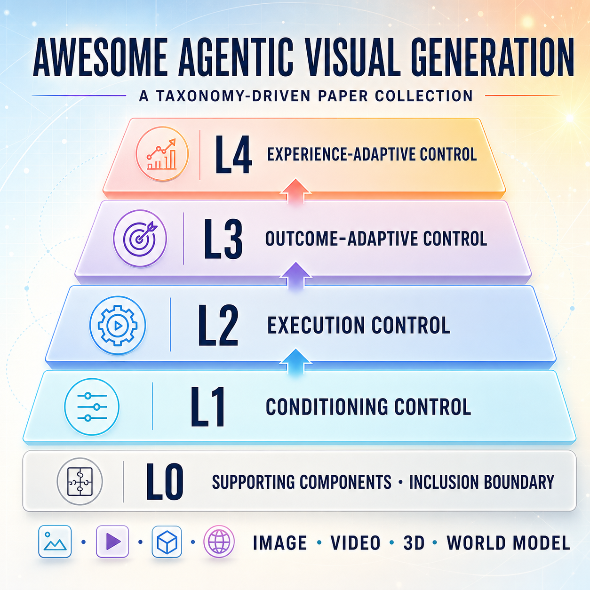

# Awesome Agentic Visual Generation

> Survey paper coming soon.

[](https://awesome.re)
[](assets/8c962330ddbefd8f2424afee5a5e4075.png)
[](https://discord.gg/C53CkwJDF)

**❤️ If you find our work useful, please consider giving a star ⭐ to this GitHub repository ❤️.**

<p align="center">
  
</p>

**Pull requests are very welcome! Please help us add new papers, official resources, or corrections.**

A curated and taxonomy-driven collection of papers on agents that plan, execute, evaluate, revise, and improve visual generation. The repository covers image generation and editing, video generation and editing, slide and user-interface generation, 3D scene construction, and world models.

The primary organization follows the maximum control authority of the system. Modality and mechanism are secondary tags. This prevents tool use, multi-agent design, memory, or reinforcement learning from being treated as agenticity levels by themselves.

## Contents

- [Scope and inclusion rule](#scope-and-inclusion-rule)
- [Controller-capability taxonomy](#controller-capability-taxonomy)
- [Supporting Components: the L0 Boundary](#supporting-components-the-l0-boundary)
- [L1: Conditioning Control](#l1-conditioning-control)
- [L2: Execution Control](#l2-execution-control)
- [L3: Outcome-Adaptive Control](#l3-outcome-adaptive-control)
- [L4: Experience-Adaptive Control](#l4-experience-adaptive-control)
- [Evaluation, Benchmarks, and Reward Models](#evaluation-benchmarks-and-reward-models)
- [Contact](#contact)
- [Community](#community)

## Scope and inclusion rule

An agentic visual generation system contains a visual generator or editor and a controller that makes generation-level decisions. In most current systems, an LLM, VLM, or MLLM is the controller and the visual generator is one of its tools. The controller may also be hybrid or internalized in a unified model, but generation capability alone does not establish agenticity.

We classify a system by the highest controller capability demonstrated by the complete method:

- The action type does not determine the level. A prompt rewrite before generation is L1, while a prompt rewrite caused by inspection of a generated image is L3.
- Tool use describes the action space. Multi-agent design describes the topology. Reinforcement learning describes a training method. None of them alone determines the level.
- A paper appears once in L1-L4 according to its maximum demonstrated level. The `Path` column records the lower-level capabilities that it also contains.
- Only fixed generators, stand-alone evaluators, reward models, and benchmarks are not generation controllers. They are listed separately.

Official resources are listed in separate `GitHub` and `Website` columns. Public repositories include live GitHub Stars badges. A dash means that no author-maintained resource could be verified at the time of the latest update. Official datasets are linked from the `Website` column. Dates use the paper's first arXiv submission month (`YYYY-MM`); for non-arXiv reports, we use the public release month.

## Controller-capability taxonomy

| Level | Controller capability | Main question | Typical controlled variables |
| :---: | --- | --- | --- |
| **L1** | Conditioning control | What should be provided to the generator? | Prompt, layout, reference, knowledge, motion plan |
| **L2** | Execution control | Which capability should be invoked, how, and when? | Generator, tool, arguments, roles, action order |
| **L3** | Outcome-adaptive control | What should happen after observing the result? | Revision, editing, rerouting, regeneration, stopping |
| **L4** | Experience-adaptive control | How should completed trajectories change future decisions? | Long-term memory, skill, capability profile, policy |

The levels form a capability progression:

```text
conditions  ->  execution  ->  current trajectory  ->  future trajectories
    L1              L2                 L3                      L4
```

Modality tags used below are `Image`, `Editing`, `Video`, `Slide`, `UI`, `3D`, and `World`.

## L1: Conditioning Control

L1 controllers construct or modify the information supplied to a generator. Generator invocation and the remaining execution procedure are externally specified or fixed.

### Prompt, preference, and intent conditioning

| Paper | GitHub | Website | Path | Modality | Primary mechanism | Date |
| --- | :---: | :---: | :---: | :---: | --- | :---: |
| [Beyond Starry Night: Shortcut-Aware Control-State Planning for Artist-Grounded Text to Image Generation](https://arxiv.org/abs/2608.06751) | - | - | L1 | Image | Condition construction and planning | 2026-08 |
| [DAC-Pose: Dual-Agent Collaborative Framework for Pose-Guided Human Generation](https://arxiv.org/abs/2608.04622) | - | - | L1 | Image | Condition construction and planning | 2026-08 |
| [Clarify Before Executing: A Self-Evolving Agent for Resolving Intent Asymmetry in 3D Tool Orchestration](https://arxiv.org/abs/2607.16352) | - | - | L1 | 3D | Condition construction and planning | 2026-07 |
| [APE: Agentic Prompt Enhancer for Image Generation and Editing](https://arxiv.org/abs/2606.00204) | - | [Website](https://research.nvidia.com/labs/sil/projects/ape/) | L1 | Image, Editing | Prompt enhancement | 2026-06 |
| [ICG: Improving Cover Image Generation via MLLM-based Prompting and Personalized Preference Alignment](https://arxiv.org/abs/2605.27374) | - | - | L1 | Image | Prompting and preference alignment | 2026-05 |
| [Agentic Planning with Reasoning for Image Styling via Offline RL](https://arxiv.org/abs/2603.07148) | - | - | L1 | Image | Condition construction and planning | 2026-03 |
| [PASTA: Preference Adaptive and Sequential Text-to-Image Generation](https://arxiv.org/abs/2412.10419) | - | [Dataset](https://www.kaggle.com/datasets/googleai/pasta-data) | L1 | Image | Preference-conditioned prompt policy | 2024-12 |
| [TIPO: Text to Image with Text Presampling for Prompt Optimization](https://arxiv.org/abs/2411.08127) | [GitHub](https://github.com/KohakuBlueleaf/KGen) [](https://github.com/KohakuBlueleaf/KGen/stargazers) | - | L1 | Image | Prompt expansion | 2024-11 |
| [DiffChat: Learning to Chat with Text-to-Image Synthesis Models](https://arxiv.org/abs/2403.04997) | [GitHub](https://github.com/alibaba/EasyNLP) [](https://github.com/alibaba/EasyNLP/stargazers) | - | L1 | Image | Instruction-conditioned prompt modification | 2024-03 |
| [POSI: Universal Prompt Optimizer for Safe Text-to-Image Generation](https://arxiv.org/abs/2402.10882) | - | - | L1 | Image | Safety-aware prompt optimization | 2024-02 |
| [Promptist: Optimizing Prompts for Text-to-Image Generation](https://arxiv.org/abs/2212.09611) | [GitHub](https://github.com/microsoft/LMOps/tree/main/promptist) [](https://github.com/microsoft/LMOps/stargazers) | [Website](https://aka.ms/promptist-demo) | L1 | Image | Learned prompt policy | 2022-12 |

### Structured and internal conditioning

| Paper | GitHub | Website | Path | Modality | Primary mechanism | Date |
| --- | :---: | :---: | :---: | :---: | --- | :---: |
| [CinemaTraj: Composing Atomic Camera Trajectories for 3D Scenes with LLM Agents](https://arxiv.org/abs/2607.26910) | - | - | L1 | Video | Condition construction and planning | 2026-07 |
| [AgentHOI: Multi-Agent Reasoning for Human-Object-Interaction Video Generation via Implicit Representation Alignment](https://arxiv.org/abs/2607.22241) | - | - | L1 | Video | Condition construction and planning | 2026-07 |
| [Agentic Designer: Progressive Multi-Agent Collaboration for Structure-Aware Interior Layout Generation](https://arxiv.org/abs/2607.20866) | - | - | L1 | 3D | Condition construction and planning | 2026-07 |
| [MetaPoint](https://arxiv.org/abs/2606.05031) | - | - | L1 | Image | Spatial-token planning | 2026-06 |
| [NaLA: A 3D Native LLM Layout Agent for High-quality 3D Scene Generation](https://arxiv.org/abs/2606.29395) | - | - | L1 | 3D | Condition construction and planning | 2026-06 |
| [TempAct: Advancing Temporal Plausibility in Autoregressive Video Generation via Planner-Executor RL](https://arxiv.org/abs/2606.28016) | - | - | L1 | Video | Condition construction and planning | 2026-06 |
| [One Image is All You Need: Agentic One-Shot Image Generation via Text-Based World Models for Long-Tail Spatial Perception](https://arxiv.org/abs/2606.20764) | - | - | L1 | World | Condition construction and planning | 2026-06 |
| [CogPortrait: Fine-Grained Eye-Region Control in Portrait Animation via Hierarchical Agent Planning](https://arxiv.org/abs/2605.28056) | - | - | L1 | Video | Condition construction and planning | 2026-05 |
| [S2ED: From Story to Executable Descriptions for Consistency-Aware Story Illustration](https://arxiv.org/abs/2605.22448) | - | - | L1 | Image | Condition construction and planning | 2026-05 |
| [Action Agent: Agentic Video Generation Meets Flow-Constrained Diffusion](https://arxiv.org/abs/2605.01477) | - | - | L1 | Video | Condition construction and planning | 2026-05 |
| [Self-Reasoning Agentic Framework for Narrative Product Grid-Collage Generation](https://arxiv.org/abs/2604.16958) | - | - | L1 | Image | Condition construction and planning | 2026-04 |
| [CANVAS: Continuity-Aware Narratives via Visual Agentic Storyboarding](https://arxiv.org/abs/2604.13452) | - | - | L1 | Image | Condition construction and planning | 2026-04 |
| [Feynman: Knowledge-Infused Diagramming Agent for Scalable Visual Designs](https://arxiv.org/abs/2603.12597) | - | - | L1 | Image | Condition construction and planning | 2026-03 |
| [StruVis: Enhancing Reasoning-based Text-to-Image Generation via Thinking with Structured Vision](https://arxiv.org/abs/2603.06032) | - | - | L1 | Image | Condition construction and planning | 2026-03 |
| [Vision-as-Inverse-Graphics Agent via Interleaved Multimodal Reasoning](https://arxiv.org/abs/2601.11109) | - | - | L1 | Image | Condition construction and planning | 2026-01 |
| [Think-Then-Generate: Reasoning-Aware Text-to-Image Diffusion with LLM Encoders](https://arxiv.org/abs/2601.10332) | - | - | L1 | Image | Condition construction and planning | 2026-01 |
| [AgentComp](https://arxiv.org/abs/2512.09081) | - | - | L1 | Image | Structured subgoal reasoning | 2025-12 |
| [DraCo: Draft as CoT for Text-to-Image Preview and Rare Concept Generation](https://arxiv.org/abs/2512.05112) | [GitHub](https://github.com/CaraJ7/DraCo) [](https://github.com/CaraJ7/DraCo/stargazers) | - | L1 | Image | Draft conditioning | 2025-12 |
| [Interleaving Reasoning for Better Text-to-Image Generation](https://arxiv.org/abs/2509.06945) | - | - | L1 | Image | Condition construction and planning | 2025-09 |
| [LLMControl](https://arxiv.org/abs/2507.19939) | - | - | L1 | Image | Grounded controls | 2025-07 |
| [PointT2I](https://arxiv.org/abs/2506.01370) | - | - | L1 | Image | Keypoint conditioning | 2025-06 |
| [GoT: Reasoning for Visual Generation and Editing](https://arxiv.org/abs/2503.10639) | [GitHub](https://github.com/rongyaofang/GoT) [](https://github.com/rongyaofang/GoT/stargazers) | - | L1 | Image, Editing | Generation-oriented reasoning | 2025-03 |
| [Region-Aware Text-to-Image Generation via Hard Binding and Soft Refinement](https://arxiv.org/abs/2411.06558) | [GitHub](https://github.com/NJU-PCALab/RAG-Diffusion) [](https://github.com/NJU-PCALab/RAG-Diffusion/stargazers) | - | L1 | Image | Region binding | 2024-11 |
| [RPG: Recaptioning, Planning, and Generating with Multimodal LLMs](https://arxiv.org/abs/2401.11708) | [GitHub](https://github.com/YangLing0818/RPG-DiffusionMaster) [](https://github.com/YangLing0818/RPG-DiffusionMaster/stargazers) | - | L1 | Image | Region planning | 2024-01 |
| [LLM Blueprint](https://arxiv.org/abs/2310.10640) | [GitHub](https://github.com/hananshafi/llmblueprint) [](https://github.com/hananshafi/llmblueprint/stargazers) | - | L1 | Image | Structured scene description | 2023-10 |
| [MGIE: Guiding Instruction-based Image Editing via Multimodal LLMs](https://arxiv.org/abs/2309.17102) | [GitHub](https://github.com/tsujuifu/pytorch_mgie) [](https://github.com/tsujuifu/pytorch_mgie/stargazers) | [Website](https://mllm-ie.github.io/) | L1 | Editing | Expressive edit instruction | 2023-09 |
| [LayoutGPT](https://arxiv.org/abs/2305.15393) | [GitHub](https://github.com/UCSB-AI/LayoutGPT) [](https://github.com/UCSB-AI/LayoutGPT/stargazers) | [Website](https://layoutgpt.github.io/) | L1 | Image, 3D | Layout planning | 2023-05 |
| [LLM-grounded Diffusion](https://arxiv.org/abs/2305.13655) | [GitHub](https://github.com/TonyLianLong/LLM-groundedDiffusion) [](https://github.com/TonyLianLong/LLM-groundedDiffusion/stargazers) | [Website](https://llm-grounded-diffusion.github.io/) | L1 | Image | Bounding-box planning | 2023-05 |

### Retrieval, world knowledge, and motion conditioning

| Paper | GitHub | Website | Path | Modality | Primary mechanism | Date |
| --- | :---: | :---: | :---: | :---: | --- | :---: |
| [RS-Gen: A Multi-Stage Agentic Framework for Reasoning and Search-Augmented Image Generation](https://arxiv.org/abs/2606.23221) | - | - | L1 | Image | Condition construction and planning | 2026-06 |
| [ShotVerse](https://arxiv.org/abs/2603.11421) | [GitHub](https://github.com/Songlin1998/ShotVerse) [](https://github.com/Songlin1998/ShotVerse/stargazers) | [Website](https://shotverse.github.io/) | L1 | Video | Multi-shot camera planning | 2026-03 |
| [Gen-Searcher](https://arxiv.org/abs/2603.28767) | [GitHub](https://github.com/tulerfeng/Gen-Searcher) [](https://github.com/tulerfeng/Gen-Searcher/stargazers) | [Website](https://gen-searcher.vercel.app/) | L1 | Image, World | Learned search for generation context | 2026-03 |
| [Mind-Brush](https://arxiv.org/abs/2602.01756) | [GitHub](https://github.com/PicoTrex/Mind-Brush) [](https://github.com/PicoTrex/Mind-Brush/stargazers) | - | L1 | Image, World | Cognitive search and reasoning | 2026-02 |
| [Open Multimodal Retrieval-Augmented Factual Image Generation](https://arxiv.org/abs/2510.22521) | - | - | L1 | Image | Condition construction and planning | 2025-10 |
| [World-to-Image](https://arxiv.org/abs/2510.04201) | [GitHub](https://github.com/mhson-kyle/World-To-Image) [](https://github.com/mhson-kyle/World-To-Image/stargazers) | - | L1 | Image, World | Agent-driven knowledge grounding | 2025-10 |
| [Cross-modal RAG](https://arxiv.org/abs/2505.21956) | [GitHub](https://github.com/mengdanzhu/Cross-modal-RAG) [](https://github.com/mengdanzhu/Cross-modal-RAG/stargazers) | - | L1 | Image | Sub-dimensional retrieval | 2025-05 |
| [IA-T2I: Internet-Augmented Text-to-Image Generation](https://arxiv.org/abs/2505.15779) | - | - | L1 | Image | Condition construction and planning | 2025-05 |
| [RealRAG](https://arxiv.org/abs/2502.00848) | [GitHub](https://github.com/charles-xjy/realrag) [](https://github.com/charles-xjy/realrag/stargazers) | - | L1 | Image | Self-reflective retrieval training | 2025-02 |
| [MotionAgent](https://arxiv.org/abs/2502.03207) | [GitHub](https://github.com/leoisufa/MotionAgent) [](https://github.com/leoisufa/MotionAgent/stargazers) | - | L1 | Video | Motion-field planning | 2025-02 |
| [ImageRAG](https://arxiv.org/abs/2502.09411) | [GitHub](https://github.com/rotem-shalev/ImageRAG) [](https://github.com/rotem-shalev/ImageRAG/stargazers) | [Website](https://rotem-shalev.github.io/ImageRAG/) | L1 | Image | Dynamic reference retrieval | 2025-02 |
| [When Cultures Meet: Multicultural Text-to-Image Generation](https://arxiv.org/abs/2502.15972) | - | - | L1 | Image | Condition construction and planning | 2025-02 |
| [VideoGen-of-Thought](https://arxiv.org/abs/2412.02259) | [GitHub](https://github.com/DuNGEOnmassster/VideoGen-of-Thought) [](https://github.com/DuNGEOnmassster/VideoGen-of-Thought/stargazers) | [Website](https://cheliosoops.github.io/VGoT/) | L1 | Video | Shot and identity planning | 2024-12 |

[Back to top](#awesome-agentic-visual-generation)

## L2: Execution Control

L2 controllers select and invoke generation-related capabilities. They can choose tools, models, arguments, roles, and action order, but the executed results do not autonomously change the remaining path.

### Tool use, expert routing, and executable programs

| Paper | GitHub | Website | Path | Modality | Primary mechanism | Date |
| --- | :---: | :---: | :---: | :---: | --- | :---: |
| [WorldClaw: Agentic 3D Open-World Generation at Scale](https://arxiv.org/abs/2608.05248) | - | - | L1+L2 | 3D | Tool and workflow orchestration | 2026-08 |
| [JarvisHub: An Open Harness for Canvas-Native Multimodal Creative Agents](https://arxiv.org/abs/2607.23588) | - | - | L1+L2 | Image | Tool and workflow orchestration | 2026-07 |
| [Knowledge-Centric Agents for Workflow Generation in ComfyUI](https://arxiv.org/abs/2607.15845) | - | - | L1+L2 | Image | Tool and workflow orchestration | 2026-07 |
| [Search Beyond What Can Be Taught: Evolving the Knowledge Boundary in Agentic Visual Generation (SearchGen)](https://arxiv.org/abs/2607.05382) | [GitHub](https://github.com/HaozheH3/SearchGen) [](https://github.com/HaozheH3/SearchGen/stargazers) | [Website](https://haozheh3.github.io/SearchGen/) | L1+L2 | Image, World | Selective image/web search, evidence filtering, and prompt integration | 2026-07 |
| [HDSL: A Hierarchical Domain-Specific Language for Structured 3D Indoor Scene Generation and Localized Editing with LLM Agents](https://arxiv.org/abs/2606.09738) | - | - | L1+L2 | 3D, Editing | Tool and workflow orchestration | 2026-06 |
| [SceneCode: Executable World Programs for Editable Indoor Scenes with Articulated Objects](https://arxiv.org/abs/2605.19587) | - | - | L1+L2 | World, Editing | Tool and workflow orchestration | 2026-05 |
| [Articraft: An Agentic System for Scalable Articulated 3D Asset Generation](https://arxiv.org/abs/2605.15187) | - | - | L1+L2 | 3D | Tool and workflow orchestration | 2026-05 |
| [GenClaw: Code-Driven Agentic Image Generation](https://arxiv.org/abs/2605.30248) | [GitHub](https://github.com/yejy53/GenClaw) [](https://github.com/yejy53/GenClaw/stargazers) | - | L1+L2 | Image | Code-driven canvas operations | 2026-05 |
| [GlyphBanana](https://arxiv.org/abs/2603.12155) | [GitHub](https://github.com/yuriYanZeXuan/GlyphBanana) [](https://github.com/yuriYanZeXuan/GlyphBanana/stargazers) | - | L1+L2 | Image | Glyph tools and workflow execution | 2026-03 |
| [ComfySearch: Autonomous Exploration and Reasoning for ComfyUI Workflows](https://arxiv.org/abs/2601.04060) | - | - | L1+L2 | Image | Tool and workflow orchestration | 2026-01 |
| [A Versatile Multimodal Agent for Multimedia Content Generation](https://arxiv.org/abs/2601.03250) | - | - | L1+L2 | Image, Video | Tool and workflow orchestration | 2026-01 |
| [Collaborative Text-to-Image Generation via Multi-Agent Reinforcement Learning](https://arxiv.org/abs/2510.10633) | - | - | L1+L2 | Image | Learned multi-agent execution | 2025-10 |
| [LLM-I: LLMs are Naturally Interleaved Multimodal Creators](https://arxiv.org/abs/2509.13642) | [GitHub](https://github.com/ByteDance-BandAI/LLM-I) [](https://github.com/ByteDance-BandAI/LLM-I/stargazers) | - | L1+L2 | Image | Search, generation, code, and editing tools | 2025-09 |
| [ComfyUI-R1: Exploring Reasoning Models for Workflow Generation](https://arxiv.org/abs/2506.09790) | - | - | L1+L2 | Image | Tool and workflow orchestration | 2025-06 |
| [ComfyUI-Copilot: An Intelligent Assistant for Automated Workflow Development](https://arxiv.org/abs/2506.05010) | - | - | L1+L2 | Image | Tool and workflow orchestration | 2025-06 |
| [Policy Optimized Text-to-Image Pipeline Design](https://arxiv.org/abs/2505.21478) | - | - | L1+L2 | Image | Generator and processing-block selection | 2025-05 |
| [ComfyGPT: A Self-Optimizing Multi-Agent System for Comprehensive ComfyUI Workflow Generation](https://arxiv.org/abs/2503.17671) | - | - | L1+L2 | Image | Tool and workflow orchestration | 2025-03 |
| [DiffusionAgent](https://arxiv.org/abs/2401.10061) | [GitHub](https://github.com/DiffusionAgent/DiffusionAgent) [](https://github.com/DiffusionAgent/DiffusionAgent/stargazers) | [Website](https://diffusionagent.github.io/) | L1+L2 | Image | Diffusion expert routing | 2024-01 |
| [Visual Programming for Text-to-Image Generation and Evaluation](https://arxiv.org/abs/2305.15328) | [GitHub](https://github.com/j-min/VPGen) [](https://github.com/j-min/VPGen/stargazers) | [Website](https://vp-t2i.github.io/) | L1+L2 | Image | Executable visual program | 2023-05 |
| [Visual ChatGPT](https://arxiv.org/abs/2303.04671) | [GitHub](https://github.com/microsoft/visual-chatgpt) [](https://github.com/microsoft/visual-chatgpt/stargazers) | - | L1+L2 | Image, Editing | Visual foundation model orchestration | 2023-03 |

### Multi-agent and long-horizon workflow orchestration

| Paper | GitHub | Website | Path | Modality | Primary mechanism | Date |
| --- | :---: | :---: | :---: | :---: | --- | :---: |
| [ParticleGen: A Multi-Agent System for Particle Effects Generation](https://arxiv.org/abs/2608.00629) | - | - | L1+L2 | Image | Tool and workflow orchestration | 2026-08 |
| [Boogu-Image-0.1: Boosting Open Agentic Multimodal Generation via Understanding under a Minimal Budget](https://arxiv.org/abs/2607.13125) | - | - | L1+L2 | Image | Tool and workflow orchestration | 2026-07 |
| [MAGIC: Transition-Aware Generation of Navigable Multi-Scene Game Worlds with Large Language Models](https://arxiv.org/abs/2607.11594) | - | - | L1+L2 | World | Tool and workflow orchestration | 2026-07 |
| [CoGen3D: An Agentic Human-AI Co-Design Pipeline for 3D Asset Generation for Virtual Reality](https://arxiv.org/abs/2607.03731) | - | - | L1+L2 | 3D | Tool and workflow orchestration | 2026-07 |
| [SimWorlds: A Multi-Agent System for Dynamic 3D Scene Creation](https://arxiv.org/abs/2607.01766) | - | - | L1+L2 | 3D | Tool and workflow orchestration | 2026-07 |
| [OrchestrXR: A Multi-Agent System for Idea-to-Prototype XR Study Authoring](https://arxiv.org/abs/2607.01588) | - | - | L1+L2 | World | Tool and workflow orchestration | 2026-07 |
| [VideoAgent: All-in-One Framework for Video Understanding and Editing](https://arxiv.org/abs/2606.23327) | - | - | L1+L2 | Video, Editing | Tool and workflow orchestration | 2026-06 |
| [OmniDrive: An LLM-Choreographed Multi-Agent World Model with Unified Latent Co-Compression for Multi-View Driving Video Generation](https://arxiv.org/abs/2606.17536) | - | - | L1+L2 | Video | Tool and workflow orchestration | 2026-06 |
| [SceneConductor: 3D Scene Generation from a Single Image with Multi-Agent Orchestration](https://arxiv.org/abs/2606.08402) | - | - | L1+L2 | 3D | Tool and workflow orchestration | 2026-06 |
| [MangaFlow: An End-to-End Agentic Framework for Controllable Story to Manga Generation](https://arxiv.org/abs/2605.28173) | - | - | L1+L2 | Image | Tool and workflow orchestration | 2026-05 |
| [One Sentence, One Drama: Personalized Short-Form Drama Generation via Multi-Agent Systems](https://arxiv.org/abs/2605.22144) | - | - | L1+L2 | Video | Tool and workflow orchestration | 2026-05 |
| [Soap2Soap: Long Cinematic Video Remaking via Multi-Agent Collaboration](https://arxiv.org/abs/2605.17423) | - | - | L1+L2 | Video | Tool and workflow orchestration | 2026-05 |
| [Cutscene Agent: An LLM Agent Framework for Automated 3D Cutscene Generation](https://arxiv.org/abs/2604.25318) | - | - | L1+L2 | 3D | Tool and workflow orchestration | 2026-04 |
| [CineAGI: Character-Consistent Movie Creation through LLM-Orchestrated Multi-Modal Generation and Cross-Scene Integration](https://arxiv.org/abs/2604.23579) | - | - | L1+L2 | Video | Tool and workflow orchestration | 2026-04 |
| [Authoring for Living Worlds: Tool-Constrained LLM Agents for Executable Multi-Actor Scenarios](https://arxiv.org/abs/2604.10383) | - | - | L1+L2 | World | Tool and workflow orchestration | 2026-04 |
| [Sima 1.0: A Collaborative Multi-Agent Framework for Documentary Video Production](https://arxiv.org/abs/2604.07721) | - | - | L1+L2 | Video | Tool and workflow orchestration | 2026-04 |
| [BOOKAGENT](https://arxiv.org/abs/2604.16541) | [GitHub](https://github.com/bogao-code/BookAgent) [](https://github.com/bogao-code/BookAgent/stargazers) | - | L1+L2 | Image, Video | Safety-aware visual narrative workflow | 2026-04 |
| [Co-Director](https://arxiv.org/abs/2604.24842) | [GitHub](https://github.com/GoogleCloudPlatform/genmedia-izumi-agent) [](https://github.com/GoogleCloudPlatform/genmedia-izumi-agent/stargazers) | [Website](https://co-director-agent.github.io/) | L1+L2 | Video | Hierarchical video workflow | 2026-04 |
| [Camera Artist](https://arxiv.org/abs/2604.09195) | - | - | L1+L2 | Video | Cinematic role orchestration | 2026-04 |
| [Towards Context-Aware Image Anonymization with Multi-Agent Reasoning](https://arxiv.org/abs/2603.27817) | - | - | L1+L2 | Image, Editing | Tool and workflow orchestration | 2026-03 |
| [Mind-of-Director: Multi-modal Agent-Driven Film Previsualization via Collaborative Decision-Making](https://arxiv.org/abs/2603.14790) | - | - | L1+L2 | Video | Tool and workflow orchestration | 2026-03 |
| [MANSION: Multi-floor lANguage-to-3D Scene generatIOn for loNg-horizon tasks](https://arxiv.org/abs/2603.11554) | - | - | L1+L2 | 3D | Tool and workflow orchestration | 2026-03 |
| [COMIC: Agentic Sketch Comedy Generation](https://arxiv.org/abs/2603.11048) | - | - | L1+L2 | Image | Tool and workflow orchestration | 2026-03 |
| [AutoUE: Automated Generation of 3D Games in Unreal Engine via Multi-Agent Systems](https://arxiv.org/abs/2603.07106) | - | - | L1+L2 | 3D | Tool and workflow orchestration | 2026-03 |
| [InfinityStory: Unlimited Video Generation with World Consistency and Character-Aware Shot Transitions](https://arxiv.org/abs/2603.03646) | - | - | L1+L2 | Video | Tool and workflow orchestration | 2026-03 |
| [BrandFusion](https://arxiv.org/abs/2603.02816) | - | [Website](https://zihao-ai.github.io/brandfusion/) | L1+L2 | Video | Brand integration workflow | 2026-03 |
| [AnimeAgent: Is the Multi-Agent via Image-to-Video models a Good Disney Storytelling Artist?](https://arxiv.org/abs/2602.20664) | - | - | L1+L2 | Video | Tool and workflow orchestration | 2026-02 |
| [PhyScensis: Physics-Augmented LLM Agents for Complex Physical Scene Arrangement](https://arxiv.org/abs/2602.14968) | - | - | L1+L2 | Image | Tool and workflow orchestration | 2026-02 |
| [SAGE: Scalable Agentic 3D Scene Generation for Embodied AI](https://arxiv.org/abs/2602.10116) | - | - | L1+L2 | 3D | Tool and workflow orchestration | 2026-02 |
| [SceneSmith: Agentic Generation of Simulation-Ready Indoor Scenes](https://arxiv.org/abs/2602.09153) | - | - | L1+L2 | Image | Tool and workflow orchestration | 2026-02 |
| [Educational Video Generation with an LLM-Based Multi-Agent System](https://arxiv.org/abs/2602.11790) | [GitHub](https://github.com/RobitsG/LASEV) [](https://github.com/RobitsG/LASEV/stargazers) | [Website](https://robitsg.github.io/LASEV/) | L1+L2 | Video | Educational video workflow | 2026-02 |
| [The Script is All You Need: An Agentic Framework for Long-Horizon Dialogue-to-Cinematic Video Generation](https://arxiv.org/abs/2601.17737) | - | - | L1+L2 | Video | Tool and workflow orchestration | 2026-01 |
| [World Craft: Agentic Framework to Create Visualizable Worlds via Text](https://arxiv.org/abs/2601.09150) | - | - | L1+L2 | World | Tool and workflow orchestration | 2026-01 |
| [AutoMV](https://arxiv.org/abs/2512.12196) | [GitHub](https://github.com/multimodal-art-projection/AutoMV) [](https://github.com/multimodal-art-projection/AutoMV/stargazers) | [Website](https://m-a-p.ai/AutoMV/) | L1+L2 | Video | Music video workflow | 2025-12 |
| [UniVA](https://arxiv.org/abs/2511.08521) | [GitHub](https://github.com/univa-agent/univa) [](https://github.com/univa-agent/univa/stargazers) | [Website](https://univa.online/) | L1+L2 | Video | Plan-and-Act tool servers | 2025-11 |
| [A Unified Multi-Agent Framework for Universal Multimodal Understanding and Generation](https://arxiv.org/abs/2508.10494) | - | - | L1+L2 | Image | Tool and workflow orchestration | 2025-08 |
| [MAViS](https://arxiv.org/abs/2508.08487) | - | - | L1+L2 | Video | Long-sequence story workflow | 2025-08 |
| [Captain Cinema: Towards Short Movie Generation](https://arxiv.org/abs/2507.18634) | - | - | L1+L2 | Video | Tool and workflow orchestration | 2025-07 |
| [AniMaker: Multi-Agent Animated Storytelling with MCTS-Driven Clip Generation](https://arxiv.org/abs/2506.10540) | - | - | L1+L2 | Image | Tool and workflow orchestration | 2025-06 |
| [Gen-n-Val: Agentic Image Data Generation and Validation](https://arxiv.org/abs/2506.04676) | - | - | L1+L2 | Image | Tool and workflow orchestration | 2025-06 |
| [MCCD](https://arxiv.org/abs/2505.02648) | - | - | L1+L2 | Image | Multi-agent compositional generation | 2025-05 |
| [CREA: A Collaborative Multi-Agent Framework for Creative Image Editing and Generation](https://arxiv.org/abs/2504.05306) | - | - | L1+L2 | Image, Editing | Tool and workflow orchestration | 2025-04 |
| [VisAgent](https://arxiv.org/abs/2503.02399) | - | - | L1+L2 | Image | Narrative visualization workflow | 2025-03 |
| [MM-StoryAgent](https://arxiv.org/abs/2503.05242) | [GitHub](https://github.com/X-PLUG/MM_StoryAgent) [](https://github.com/X-PLUG/MM_StoryAgent/stargazers) | - | L1+L2 | Image, Video | Multimodal narrated story workflow | 2025-03 |
| [MovieAgent](https://arxiv.org/abs/2503.07314) | [GitHub](https://github.com/showlab/MovieAgent) [](https://github.com/showlab/MovieAgent/stargazers) | [Website](https://weijiawu.github.io/MovieAgent/) | L1+L2 | Video | Hierarchical script-to-shot workflow | 2025-03 |
| [Long-Video Audio Synthesis with Multi-Agent Collaboration](https://arxiv.org/abs/2503.10719) | [GitHub](https://github.com/ZYH-Lightyear/LVAS) [](https://github.com/ZYH-Lightyear/LVAS/stargazers) | [Website](https://lvas-agent.github.io/) | L1+L2 | Video | Audio workflow orchestration | 2025-03 |
| [FilmAgent](https://arxiv.org/abs/2501.12909) | [GitHub](https://github.com/HITsz-TMG/FilmAgent) [](https://github.com/HITsz-TMG/FilmAgent/stargazers) | [Website](https://filmagent.github.io/) | L1+L2 | Video, 3D | Virtual film crew | 2025-01 |
| [StoryAgent](https://arxiv.org/abs/2411.04925) | - | - | L1+L2 | Image, Video | Storyboard and character workflow | 2024-11 |
| [DreamFactory](https://arxiv.org/abs/2408.11788) | - | - | L1+L2 | Video | Multi-scene workflow | 2024-08 |
| [Kubrick](https://arxiv.org/abs/2408.10453) | - | [Website](https://kubrick9.github.io/) | L1+L2 | Video, 3D | Executable scene workflow | 2024-08 |
| [Anim-Director](https://arxiv.org/abs/2408.09787) | [GitHub](https://github.com/HITsz-TMG/Anim-Director) [](https://github.com/HITsz-TMG/Anim-Director/stargazers) | - | L1+L2 | Video | Controllable animation workflow | 2024-08 |
| [Mora](https://arxiv.org/abs/2403.13248) | [GitHub](https://github.com/lichao-sun/Mora) [](https://github.com/lichao-sun/Mora/stargazers) | - | L1+L2 | Video | Multi-agent video modules | 2024-03 |

### Structured visual artifacts: slides and user interfaces

| Paper | GitHub | Website | Path | Modality | Primary mechanism | Date |
| --- | :---: | :---: | :---: | :---: | --- | :---: |
| [SeaSlides: Semantic Abstraction Layer for Agentic Slide Generation](https://arxiv.org/abs/2608.03298) | - | - | L1+L2 | Slide | Tool and workflow orchestration | 2026-08 |
| [PosterMELD: Multi-Agent Paper-to-Poster Generation for Controllable Design Diversity with Editable Print-Ready Outputs](https://arxiv.org/abs/2608.02218) | - | - | L1+L2 | Image, Editing | Tool and workflow orchestration | 2026-08 |
| [CADIR: A Cross-Backend Editable Intermediate Representation for Agentic CAD Generation](https://arxiv.org/abs/2608.00891) | - | - | L1+L2 | Slide, Editing | Tool and workflow orchestration | 2026-08 |
| [ETPDesigner: Multi-Agent Orchestration for Interactive Multimodal Electronic Theater Program](https://arxiv.org/abs/2607.19947) | - | - | L1+L2 | Image | Tool and workflow orchestration | 2026-07 |
| [Exploring Agentic Workflows for Generating High Quality Math Visual Aids](https://arxiv.org/abs/2607.09839) | - | - | L1+L2 | Image | Tool and workflow orchestration | 2026-07 |
| [OmniPresent: Generating Coherent Presentation Suites from Scientific Papers](https://arxiv.org/abs/2607.02590) | - | - | L1+L2 | Slide | Tool and workflow orchestration | 2026-07 |
| [SAGE: Structured Agentic Graph Editing for Software Diagrams](https://arxiv.org/abs/2607.01102) | - | - | L1+L2 | Image, Editing | Tool and workflow orchestration | 2026-07 |
| [Presentation Slide Translation and Layout Error Correction by LLMs](https://aclanthology.org/2026.acl-srw.26/) | - | - | L1+L2 | Slide, Editing | Image-and-XML-guided translation and layout repair | 2026-07 |
| [Any2Poster: Any-Source Poster Generation Across Modalities and Domains](https://arxiv.org/abs/2606.02915) | - | - | L1+L2 | Image | Tool and workflow orchestration | 2026-06 |
| [TVIR: Building Deep Research Agents Towards Text-Visual Interleaved Report Generation](https://arxiv.org/abs/2606.02320) | - | - | L1+L2 | Image | Tool and workflow orchestration | 2026-06 |
| [Crafter: A Multi-Agent Harness for Editable Scientific Figure Generation from Diverse Inputs](https://arxiv.org/abs/2605.30611) | - | - | L1+L2 | Image, Editing | Tool and workflow orchestration | 2026-05 |
| [Code2UML: Agentic LLMs with context engineering for scalable software visualization](https://arxiv.org/abs/2605.24453) | - | - | L1+L2 | Image | Tool and workflow orchestration | 2026-05 |
| [LiveFigure: Generating Editable Scientific Illustration with VLM Agents](https://arxiv.org/abs/2605.23527) | - | - | L1+L2 | Image, Editing | Tool and workflow orchestration | 2026-05 |
| [PresentAgent-2: Towards Generalist Multimodal Presentation Agents](https://arxiv.org/abs/2605.11363) | - | - | L1+L2 | Slide | Tool and workflow orchestration | 2026-05 |
| [Automatic Slide Updating with User-Defined Dynamic Templates and Natural Language Instructions (SlideAgent)](https://arxiv.org/abs/2604.17894) | [GitHub](https://github.com/XiaoZhou2024/SlideAgent) [](https://github.com/XiaoZhou2024/SlideAgent/stargazers) | - | L1+L2 | Slide, Editing | Structure parsing, retrieval, and object-level tool execution | 2026-04 |
| [Automatic Method Illustration Generation for AI Scientific Papers via Drawing Middleware Creation, Evolution, and Orchestration](https://arxiv.org/abs/2603.29590) | - | - | L1+L2 | Image | Tool and workflow orchestration | 2026-03 |
| [Learning to Present: Inverse Specification Rewards for Agentic Slide Generation](https://arxiv.org/abs/2603.16839) | - | - | L1+L2 | Slide | Tool and workflow orchestration | 2026-03 |
| [GameUIAgent: An LLM-Powered Framework for Automated Game UI Design with Structured Intermediate Representation](https://arxiv.org/abs/2603.14724) | - | - | L1+L2 | Slide | Tool and workflow orchestration | 2026-03 |
| [PaperX: A Unified Framework for Multimodal Academic Presentation Generation with Scholar DAG](https://arxiv.org/abs/2602.03866) | - | - | L1+L2 | Slide | Tool and workflow orchestration | 2026-02 |
| [APEX: Academic Poster Editing Agentic Expert](https://arxiv.org/abs/2601.04794) | - | - | L1+L2 | 3D, Editing | Tool and workflow orchestration | 2026-01 |
| [MiLDEdit: Reasoning-Based Multi-Layer Design Document Editing](https://arxiv.org/abs/2601.04589) | - | - | L1+L2 | Image, Editing | Tool and workflow orchestration | 2026-01 |
| [SciFig: Towards Automating Editable Figure Generation for Scientific Papers](https://arxiv.org/abs/2601.04390) | - | - | L1+L2 | Image, Editing | Tool and workflow orchestration | 2026-01 |
| [SlideTailor: Personalized Presentation Slide Generation for Scientific Papers](https://arxiv.org/abs/2512.20292) | [GitHub](https://github.com/nusnlp/SlideTailor) [](https://github.com/nusnlp/SlideTailor/stargazers) | - | L1+L2 | Slide | Preference distillation, layout-aware planning, and code execution | 2025-12 |
| [WebVIA: A Web-based Vision-Language Agentic Framework for Interactive and Verifiable UI-to-Code Generation](https://arxiv.org/abs/2511.06251) | [GitHub](https://github.com/zheny2751-dotcom/WebVIA) [](https://github.com/zheny2751-dotcom/WebVIA/stargazers) | [Website](https://zheny2751-dotcom.github.io/webvia.github.io/) | L1+L2 | UI | Multi-state exploration, code generation, and terminal validation | 2025-11 |
| [From Pixels to Paths: A Multi-Agent Framework for Editable Scientific Illustration](https://arxiv.org/abs/2510.27452) | - | - | L1+L2 | Image, Editing | Tool and workflow orchestration | 2025-10 |
| [PosterGen: Aesthetic-Aware Multi-Modal Paper-to-Poster Generation via Multi-Agent LLMs](https://arxiv.org/abs/2508.17188) | - | - | L1+L2 | Image | Tool and workflow orchestration | 2025-08 |
| [ScreenCoder: Advancing Visual-to-Code Generation for Front-End Automation via Modular Multimodal Agents](https://arxiv.org/abs/2507.22827) | [GitHub](https://github.com/leigest519/ScreenCoder) [](https://github.com/leigest519/ScreenCoder/stargazers) | - | L1+L2 | UI | Grounding, hierarchical planning, and code-generation agents | 2025-07 |
| [PreGenie: An Agentic Framework for High-quality Visual Presentation Generation](https://arxiv.org/abs/2505.21660) | - | - | L1+L2 | Slide | Tool and workflow orchestration | 2025-05 |
| [Talk to Your Slides: High-Efficiency Slide Editing via Language-Driven Structured Data Manipulation](https://arxiv.org/abs/2505.11604) | [GitHub](https://github.com/KyuDan1/Talk-to-Your-Slides) [](https://github.com/KyuDan1/Talk-to-Your-Slides/stargazers) | - | L1+L2 | Slide, Editing | Semantic planning and PowerPoint object-model execution | 2025-05 |
| [PPTAgent: Generating and Evaluating Presentations Beyond Text-to-Slides](https://arxiv.org/abs/2501.03936) | [GitHub](https://github.com/icip-cas/PPTAgent) [](https://github.com/icip-cas/PPTAgent/stargazers) | - | L1+L2 | Slide | Reference analysis and edit-action generation | 2025-01 |

[Back to top](#awesome-agentic-visual-generation)

## L3: Outcome-Adaptive Control

L3 controllers observe a generated artifact, rendered state, tool result, verifier report, reward, or user response and use that observation to choose the next action in the current trajectory.

### Prompt feedback and compositional correction

| Paper | GitHub | Website | Path | Modality | Primary mechanism | Date |
| --- | :---: | :---: | :---: | :---: | --- | :---: |
| [VisPuzzle: Task-Aware Composite Visualization Construction](https://arxiv.org/abs/2608.11635) | - | - | L1+L2+L3 | Image | Outcome-aware verification and revision | 2026-08 |
| [GVR-Coder: A Visual-Feedback Framework for Structured SVG Generation in Complex Document and Meeting Scenarios](https://arxiv.org/abs/2607.28073) | - | - | L1+L2+L3 | Image | Outcome-aware verification and revision | 2026-07 |
| [PRISM: Prompt Refinement via Image-grounded Self-rewarding Mechanism for Text-to-Image Generation](https://arxiv.org/abs/2607.24353) | - | - | L1+L2+L3 | Image | Outcome-aware verification and revision | 2026-07 |
| [Render-in-the-Loop: Vector Graphics Generation via Visual Self-Feedback](https://arxiv.org/abs/2604.20730) | - | - | L1+L2+L3 | Image | Outcome-aware verification and revision | 2026-04 |
| [Agentic Flow Steering and Parallel Rollout Search for Spatially Grounded Text-to-Image Generation](https://arxiv.org/abs/2603.18627) | - | - | L1+L2+L3 | Image | Outcome-aware verification and revision | 2026-03 |
| [coDrawAgents](https://arxiv.org/abs/2603.12829) | [GitHub](https://github.com/ChunhanLiii/coDrawAgents) [](https://github.com/ChunhanLiii/coDrawAgents/stargazers) | - | L1+L2+L3 | Image | Multi-round scene construction | 2026-03 |
| [M3](https://arxiv.org/abs/2602.06166) | [GitHub](https://github.com/LINs-lab/M3) [](https://github.com/LINs-lab/M3/stargazers) | - | L1+L2+L3 | Image | Multi-agent visual diagnosis | 2026-02 |
| [PerfGuard: A Performance-Aware Agent for Visual Content Generation](https://arxiv.org/abs/2601.22571) | - | - | L1+L2+L3 | Image | Outcome-aware verification and revision | 2026-01 |
| [GenPilot](https://arxiv.org/abs/2510.07217) | [GitHub](https://github.com/27yw/GenPilot) [](https://github.com/27yw/GenPilot/stargazers) | - | L1+L2+L3 | Image | Error analysis and prompt refinement | 2025-10 |
| [PromptSculptor](https://arxiv.org/abs/2509.12446) | - | - | L1+L2+L3 | Image | Multi-agent self-evaluation | 2025-09 |
| [CountLoop](https://arxiv.org/abs/2508.16644) | - | [Website](https://mondalanindya.github.io/CountLoop/) | L1+L3 | Image | Counting feedback loop | 2025-08 |
| [Test-time Prompt Refinement](https://arxiv.org/abs/2507.22076) | - | - | L1+L3 | Image | Iterative visual diagnosis | 2025-07 |
| [RATTPO](https://arxiv.org/abs/2506.16853) | [GitHub](https://github.com/seminkim/RATTPO) [](https://github.com/seminkim/RATTPO/stargazers) | - | L1+L3 | Image | Reward-history prompt search | 2025-06 |
| [VisualPrompter](https://arxiv.org/abs/2506.23138) | [GitHub](https://github.com/teheperinko541/VisualPrompter) [](https://github.com/teheperinko541/VisualPrompter/stargazers) | - | L1+L3 | Image | Image-grounded prompt repair | 2025-06 |
| [ComfyMind: Toward General-Purpose Generation via Tree-Based Planning and Reactive Feedback](https://arxiv.org/abs/2505.17908) | - | - | L1+L2+L3 | Image | Outcome-aware verification and revision | 2025-05 |
| [Twin Co-Adaptive Dialogue](https://arxiv.org/abs/2504.14868) | - | - | L1+L3 | Image | Progressive dialogue and image updates | 2025-04 |
| [Marmot: Object-Level Self-Correction via Multi-Agent Reasoning](https://arxiv.org/abs/2504.20054) | - | - | L1+L2+L3 | Image | Outcome-aware verification and revision | 2025-04 |
| [LayerCraft](https://arxiv.org/abs/2504.00010) | [GitHub](https://github.com/PeterYYZhang/LayerCraft) [](https://github.com/PeterYYZhang/LayerCraft/stargazers) | - | L1+L3 | Image | Layered integration and revision | 2025-04 |
| [OPT2I: Improving Text-to-Image Consistency via Automatic Prompt Optimization](https://arxiv.org/abs/2403.17804) | - | - | L1+L3 | Image | Rendered-score prompt search | 2024-03 |
| [MuLan](https://arxiv.org/abs/2402.12741) | [GitHub](https://github.com/measure-infinity/mulan-code) [](https://github.com/measure-infinity/mulan-code/stargazers) | - | L1+L3 | Image | Progressive construction | 2024-02 |
| [CompAgent](https://arxiv.org/abs/2401.15688) | - | - | L1+L3 | Image | Visual-feedback correction | 2024-01 |
| [Promptify: Interactive Prompt Exploration with Large Language Models](https://arxiv.org/abs/2304.09337) | [GitHub](https://github.com/promptslab/Promptify) [](https://github.com/promptslab/Promptify/stargazers) | - | L1+L3 | Image | Candidate-driven user feedback | 2023-04 |

### Tool orchestration, routing, and world grounding with feedback

| Paper | GitHub | Website | Path | Modality | Primary mechanism | Date |
| --- | :---: | :---: | :---: | :---: | --- | :---: |
| [ToolArtist: Tool-Using Unified Multimodal Models for Agentic Image Generation](https://arxiv.org/abs/2608.04436) | [GitHub](https://github.com/bubble65/EMU-Agentic-PostTrain) [](https://github.com/bubble65/EMU-Agentic-PostTrain/stargazers) | [Dataset](https://huggingface.co/datasets/bubble65/EMU-Agentic-PostTrain-Data) | L1+L2+L3 | Image, World | Unified search, native drawing, inspection, and revision | 2026-08 |
| [Monte Carlo Tree Search for Table-to-Multimodal Report Generation](https://arxiv.org/abs/2608.04071) | - | - | L1+L2+L3 | Image | Outcome-aware verification and revision | 2026-08 |
| [PairCoder++: Pair Programming as a Universal Paradigm for Verified Code-Driven Multimodal and Structured-Artifact Generation](https://arxiv.org/abs/2607.01883) | - | - | L1+L2+L3 | Image | Outcome-aware verification and revision | 2026-07 |
| [Qwen-Image-Agent](https://arxiv.org/abs/2606.26907) | - | - | L1+L2+L3 | Image, World | Search, memory, editing, and feedback | 2026-06 |
| [Generation Navigator](https://arxiv.org/abs/2605.17969) | - | - | L1+L2+L3 | Image | State-aware action choice | 2026-05 |
| [SCOPE](https://arxiv.org/abs/2605.08043) | [GitHub](https://github.com/nopnor/SCOPE) [](https://github.com/nopnor/SCOPE/stargazers) | [Website](https://nopnor.github.io/SCOPE/) | L1+L2+L3 | Image | Specification-guided skill orchestration, verification, and repair | 2026-05 |
| [Unify-Agent](https://arxiv.org/abs/2603.29620) | [GitHub](https://github.com/shawn0728/Unify-Agent) [](https://github.com/shawn0728/Unify-Agent/stargazers) | - | L1+L2+L3 | Image, World | Search-generation workflow | 2026-03 |
| [AutoFigure: Generating and Refining Publication-Ready Scientific Illustrations](https://arxiv.org/abs/2602.03828) | - | - | L1+L2+L3 | Image | Outcome-aware verification and revision | 2026-02 |
| [UniReason 1.0](https://arxiv.org/abs/2602.02437) | [GitHub](https://github.com/AlenjandroWang/UniReason) [](https://github.com/AlenjandroWang/UniReason/stargazers) | - | L1+L3 | Image, Editing, World | Knowledge reasoning and correction | 2026-02 |
| [GenAgent](https://arxiv.org/abs/2601.18543) | - | - | L1+L2+L3 | Image | Trained tool use and reflection | 2026-01 |
| [Image-POSER](https://arxiv.org/abs/2511.11780) | - | - | L1+L2+L3 | Image, Editing | Reflective expert routing | 2025-11 |
| [ImAgent](https://arxiv.org/abs/2511.11483) | - | - | L1+L2+L3 | Image | Policy-controlled test-time actions | 2025-11 |
| [Maestro](https://arxiv.org/abs/2509.10704) | - | - | L1+L2+L3 | Image | Critic-guided orchestration | 2025-09 |
| [T2I-Copilot](https://arxiv.org/abs/2507.20536) | [GitHub](https://github.com/SHI-Labs/T2I-Copilot) [](https://github.com/SHI-Labs/T2I-Copilot/stargazers) | - | L1+L2+L3 | Image | Evaluator-controlled regeneration | 2025-07 |
| [GenArtist](https://arxiv.org/abs/2407.05600) | - | [Website](https://zhenyuw16.github.io/GenArtist_page/) | L1+L2+L3 | Image, Editing | Tool tree, verification, and repair | 2024-07 |

### Unified and latent closed-loop generation

| Paper | GitHub | Website | Path | Modality | Primary mechanism | Date |
| --- | :---: | :---: | :---: | :---: | --- | :---: |
| [InterleaveThinker: Reinforcing Agentic Interleaved Generation](https://arxiv.org/abs/2606.13679) | - | - | L1+L2+L3 | Image | Outcome-aware verification and revision | 2026-06 |
| [AlphaGRPO](https://arxiv.org/abs/2605.12495) | [GitHub](https://github.com/huangrh99/AlphaGRPO) [](https://github.com/huangrh99/AlphaGRPO/stargazers) | [Website](https://huangrh99.github.io/AlphaGRPO/) | L1+L3 | Image | Self-reflective verifiable rewards | 2026-05 |
| [Latent Action Control](https://arxiv.org/abs/2605.16961) | - | - | L1+L3 | Image | Latent diagnosis and halting | 2026-05 |
| [Large Language Models are Universal Reasoners for Visual Generation](https://arxiv.org/abs/2605.04040) | - | - | L1+L3 | Image | Draft and grounded self-critique | 2026-05 |
| [Self-Adaptive Interleaved Visual Reasoner](https://arxiv.org/abs/2605.14709) | [GitHub](https://github.com/WeChatCV/Interleaved_Visual_Reasoner) [](https://github.com/WeChatCV/Interleaved_Visual_Reasoner/stargazers) | - | L1+L3 | Image | Adaptive reflection and planning | 2026-05 |
| [Think in Strokes, Not Pixels](https://arxiv.org/abs/2604.04746) | - | - | L1+L3 | Image | Interleaved draft and reflection | 2026-04 |
| [FiRe](https://arxiv.org/abs/2604.13491) | - | - | L1+L3 | Image | Fine-grained multimodal reflection | 2026-04 |
| [VisionCreator: A Native Visual-Generation Agentic Model with Understanding, Thinking, Planning and Creation](https://arxiv.org/abs/2603.02681) | - | - | L1+L2+L3 | Image | Outcome-aware verification and revision | 2026-03 |
| [RAISE: Requirement-Adaptive Evolutionary Refinement for Training-Free Text-to-Image Alignment](https://arxiv.org/abs/2603.00483) | - | - | L1+L2+L3 | Image | Outcome-aware verification and revision | 2026-03 |
| [UniT](https://arxiv.org/abs/2602.12279) | - | [Website](https://ai.meta.com/research/publications/unit-unified-multimodal-chain-of-thought-test-time-scaling/) | L1+L3 | Image | Sequential generation and refinement | 2026-02 |
| [ThinkGen](https://arxiv.org/abs/2512.23568) | [GitHub](https://github.com/jiaosiyuu/ThinkGen) [](https://github.com/jiaosiyuu/ThinkGen/stargazers) | - | L1+L3 | Image | Alternating reasoner-generator learning | 2025-12 |
| [MILR](https://arxiv.org/abs/2509.22761) | [GitHub](https://github.com/spatigen/MILR) [](https://github.com/spatigen/MILR/stargazers) | [Website](https://spatigen.github.io/milr.io/) | L1+L3 | Image | Test-time latent search | 2025-09 |
| [Uni-CoT](https://arxiv.org/abs/2508.05606) | [GitHub](https://github.com/Fr0zenCrane/UniCoT) [](https://github.com/Fr0zenCrane/UniCoT/stargazers) | [Website](https://sais-fuxi.github.io/projects/uni-cot/) | L1+L3 | Image | Macro and micro visual reasoning | 2025-08 |
| [UniGen](https://arxiv.org/abs/2505.14682) | - | - | L1+L3 | Image | Candidate verification and selection | 2025-05 |
| [FoX](https://arxiv.org/abs/2503.01298) | - | - | L1+L3 | Image | Planning, acting, reflection, correction | 2025-03 |
| [Image CoT](https://arxiv.org/abs/2501.13926) | [GitHub](https://github.com/ZiyuGuo99/Image-Generation-CoT) [](https://github.com/ZiyuGuo99/Image-Generation-CoT/stargazers) | - | L1+L3 | Image | Stepwise generation and verification | 2025-01 |

### Image and video editing with artifact feedback

| Paper | GitHub | Website | Path | Modality | Primary mechanism | Date |
| --- | :---: | :---: | :---: | :---: | --- | :---: |
| [Domain-Grounded Candidate Selection for Agentic Image Editing: A Shadow Removal Case](https://arxiv.org/abs/2608.06075) | - | - | L1+L2+L3 | Image, Editing | Outcome-aware verification and revision | 2026-08 |
| [Crayotter: Learning Long-Horizon Video Editing Agents via Group-Relative Preference Backpropagation](https://arxiv.org/abs/2608.02694) | - | - | L1+L2+L3 | Video, Editing | Outcome-aware verification and revision | 2026-08 |
| [DrawAI: Agentic Benchmark and Workflow for Making Raster Images Editable](https://arxiv.org/abs/2608.00548) | - | - | L1+L2+L3 | Image, Editing | Outcome-aware verification and revision | 2026-08 |
| [What to Edit Next: Visually Aligned Image-Editing Follow-Up Suggestions in Conversational Systems](https://arxiv.org/abs/2608.07565) | - | - | L1+L3 | Image, Editing | Current-image-conditioned follow-up edit policy | 2026-08 |
| [What Can I Edit? Open-Ended Strategy Discovery and the Emotion Editability Landscape](https://arxiv.org/abs/2607.23920) | - | - | L1+L2+L3 | Image, Editing | Outcome-aware verification and revision | 2026-07 |
| [Cognitive-structured Multimodal Agent for Multimodal Understanding, Generation, and Editing](https://arxiv.org/abs/2607.08497) | - | - | L1+L2+L3 | Image, Editing | Outcome-aware verification and revision | 2026-07 |
| [CanvasAgent: Enabling Complex Image Creation and Editing via Visual Tool Orchestration](https://arxiv.org/abs/2607.05465) | - | - | L1+L2+L3 | Image, Editing | Outcome-aware verification and revision | 2026-07 |
| [GMO-E$^2$DIT: Grounded Multi-Operation Editing for E-Commerce Images](https://arxiv.org/abs/2607.00920) | - | - | L1+L2+L3 | Image, Editing | Outcome-aware verification and revision | 2026-07 |
| [Crayotter](https://arxiv.org/abs/2606.07636) | [GitHub](https://github.com/idwts/Crayotter) [](https://github.com/idwts/Crayotter/stargazers) | - | L1+L2+L3 | Video, Editing | Traceable iterative workflow | 2026-06 |
| [Taming I2V models for Image HOI Editing: A Cognitive Benchmark and Agentic Self-Correcting Framework](https://arxiv.org/abs/2606.19073) | - | - | L1+L2+L3 | Image, Editing | Outcome-aware verification and revision | 2026-06 |
| [SceneCraft: Interactive System for Image Editing via Scene Graph](https://arxiv.org/abs/2606.16103) | - | - | L1+L2+L3 | Image, Editing | Outcome-aware verification and revision | 2026-06 |
| [IEA: Amateur-Friendly Conversational Image Editing Agent via Three Stages of Multitask Alignment](https://arxiv.org/abs/2606.08016) | - | - | L1+L2+L3 | Image, Editing | Outcome-aware verification and revision | 2026-06 |
| [Aurora](https://arxiv.org/abs/2605.18748) | [GitHub](https://github.com/yeates/Aurora) [](https://github.com/yeates/Aurora/stargazers) | [Website](https://yeates.github.io/Aurora-Page/) | L1+L2+L3 | Video, Editing | Tool-using video editor | 2026-05 |
| [From Plans to Pixels: Learning to Plan and Orchestrate for Open-Ended Image Editing](https://arxiv.org/abs/2605.15181) | - | - | L1+L2+L3 | Image, Editing | Outcome-aware verification and revision | 2026-05 |
| [EditRefiner](https://arxiv.org/abs/2605.07457) | [GitHub](https://github.com/IntMeGroup/EditRefiner) [](https://github.com/IntMeGroup/EditRefiner/stargazers) | - | L1+L3 | Editing | Human-aligned iterative refinement | 2026-05 |
| [Making Image Editing Easier via Adaptive Task Reformulation with Agentic Executions](https://arxiv.org/abs/2604.15917) | - | - | L1+L2+L3 | Image, Editing | Outcome-aware verification and revision | 2026-04 |
| [GLANCE: A Global-Local Coordination Multi-Agent Framework for Music-Grounded Non-Linear Video Editing](https://arxiv.org/abs/2604.05076) | - | - | L1+L2+L3 | Video, Editing | Outcome-aware verification and revision | 2026-04 |
| [DIRECT: Video Mashup Creation via Hierarchical Multi-Agent Planning and Intent-Guided Editing](https://arxiv.org/abs/2604.04875) | - | - | L1+L2+L3 | Video, Editing | Outcome-aware verification and revision | 2026-04 |
| [CAMEO: A Conditional and Quality-Aware Multi-Agent Image Editing Orchestrator](https://arxiv.org/abs/2604.03156) | - | - | L1+L2+L3 | Image, Editing | Outcome-aware verification and revision | 2026-04 |
| [CineAgents](https://arxiv.org/abs/2604.10456) | - | - | L1+L2+L3 | Video, Editing | Iterative cinematic compilation | 2026-04 |
| [Refinement via Regeneration](https://arxiv.org/abs/2604.25636) | [GitHub](https://github.com/LeapLabTHU/RvR) [](https://github.com/LeapLabTHU/RvR/stargazers) | - | L1+L3 | Image, Editing | Adaptive modification space | 2026-04 |
| [IMAGAgent: Orchestrating Multi-Turn Image Editing via Constraint-Aware Planning and Reflection](https://arxiv.org/abs/2603.29602) | - | - | L1+L2+L3 | Image, Editing | Outcome-aware verification and revision | 2026-03 |
| [MSRAMIE: Multimodal Structured Reasoning Agent for Multi-instruction Image Editing](https://arxiv.org/abs/2603.16967) | - | - | L1+L2+L3 | Image, Editing | Outcome-aware verification and revision | 2026-03 |
| [ImageEdit-R1: Boosting Multi-Agent Image Editing via Reinforcement Learning](https://arxiv.org/abs/2603.08059) | - | - | L1+L2+L3 | Image, Editing | Outcome-aware verification and revision | 2026-03 |
| [CutClaw](https://arxiv.org/abs/2603.29664) | [GitHub](https://github.com/GVCLab/CutClaw) [](https://github.com/GVCLab/CutClaw/stargazers) | - | L1+L2+L3 | Video, Editing | Hours-long timeline control | 2026-03 |
| [RetouchIQ: MLLM Agents for Instruction-Based Image Retouching with Generalist Reward](https://arxiv.org/abs/2602.17558) | - | - | L1+L2+L3 | Image, Editing | Outcome-aware verification and revision | 2026-02 |
| [Agent Banana](https://arxiv.org/abs/2602.09084) | [GitHub](https://github.com/taco-group/agent-banana) [](https://github.com/taco-group/agent-banana/stargazers) | [Website](https://agent-banana.github.io/) | L1+L2+L3 | Editing | Multi-step reasoning and tools | 2026-02 |
| [PhotoAgent](https://arxiv.org/abs/2602.22809) | - | [Website](https://mdyao.github.io/PhotoAgent/) | L1+L2+L3 | Editing | Long-horizon aesthetic planning | 2026-02 |
| [Agentic Retoucher](https://arxiv.org/abs/2601.02046) | [GitHub](https://github.com/MediaX-SJTU/Agentic-Retoucher) [](https://github.com/MediaX-SJTU/Agentic-Retoucher/stargazers) | - | L1+L2+L3 | Image, Editing | Defect localization and retouching | 2026-01 |
| [JarvisEvo: Towards a Self-Evolving Photo Editing Agent with Synergistic Editor-Evaluator Optimization](https://arxiv.org/abs/2511.23002) | - | - | L1+L2+L3 | Image, Editing | Outcome-aware verification and revision | 2025-11 |
| [MIRA: Multimodal Iterative Reasoning Agent for Image Editing](https://arxiv.org/abs/2511.21087) | - | - | L1+L2+L3 | Image, Editing | Outcome-aware verification and revision | 2025-11 |
| [Text-Driven Reasoning Video Editing via Reinforcement Learning](https://arxiv.org/abs/2511.14100) | - | - | L1+L2+L3 | Video, Editing | Digital-twin reasoning | 2025-11 |
| [EditDuet](https://arxiv.org/abs/2509.10761) | - | - | L1+L2+L3 | Video, Editing | Proposal and critique | 2025-09 |
| [An LLM-LVLM Driven Agent for Iterative and Fine-Grained Image Editing](https://arxiv.org/abs/2508.17435) | - | - | L1+L2+L3 | Image, Editing | Outcome-aware verification and revision | 2025-08 |
| [Talk2Image: A Multi-Agent System for Multi-Turn Image Generation and Editing](https://arxiv.org/abs/2508.06916) | - | - | L1+L2+L3 | Image, Editing | Outcome-aware verification and revision | 2025-08 |
| [Beyond Simple Edits: X-Planner for Complex Instruction-Based Image Editing](https://arxiv.org/abs/2507.05259) | - | - | L1+L2+L3 | Image, Editing | Outcome-aware verification and revision | 2025-07 |
| [Image Editing as Programs with Diffusion Models](https://arxiv.org/abs/2506.04158) | [GitHub](https://github.com/YujiaHu1109/IEAP) [](https://github.com/YujiaHu1109/IEAP/stargazers) | [Website](https://yujiahu1109.github.io/IEAP/) | L1+L2+L3 | Editing | Verified sequential edit operations | 2025-06 |
| [LAVE](https://arxiv.org/abs/2402.10294) | - | [Website](https://www.dgp.toronto.edu/~bryanw/lave/) | L1+L2+L3 | Video, Editing | Timeline state and user revision | 2024-02 |
| [Self-correcting LLM-controlled Diffusion Models](https://arxiv.org/abs/2311.16090) | [GitHub](https://github.com/tsunghan-wu/SLD) [](https://github.com/tsunghan-wu/SLD/stargazers) | [Website](https://self-correcting-llm-diffusion.github.io/) | L1+L3 | Image | Requirement inspection and repair | 2023-11 |

### Video, 3D, and persistent world-state control

| Paper | GitHub | Website | Path | Modality | Primary mechanism | Date |
| --- | :---: | :---: | :---: | :---: | --- | :---: |
| [AVA-Encoder: Towards Agent-Native Video Representation Learning](https://arxiv.org/abs/2608.12313) | [GitHub](https://github.com/HBDYW/AVA-Encoder) [](https://github.com/HBDYW/AVA-Encoder/stargazers) | [Website](https://ava-encoder.github.io/) | L1+L3 | Video | Reconstruction-feedback refinement of a film knowledge graph | 2026-08 |
| [StateFlow: Building, Evolving, and Accessing 3D World States for Previsualization](https://arxiv.org/abs/2608.12314) | - | - | L1+L2+L3 | 3D | Outcome-aware verification and revision | 2026-08 |
| [Beyond Trial-and-Error: Agentic Optimization for Image-to-Video Adherence](https://arxiv.org/abs/2608.12290) | - | - | L1+L2+L3 | Video | Outcome-aware verification and revision | 2026-08 |
| [iARCS: Iterative Agentic RL for Controllable 3D Scene Generation](https://arxiv.org/abs/2608.06161) | - | - | L1+L2+L3 | 3D | Outcome-aware verification and revision | 2026-08 |
| [PlanCraft: Sketch, Refine, and Furnish for Architect-Inspired Progressive 3D Residential Scene Generation](https://arxiv.org/abs/2607.23491) | - | - | L1+L2+L3 | 3D | Outcome-aware verification and revision | 2026-07 |
| [GS-Agent: Creating 4D Physical Worlds With Generative Simulation](https://arxiv.org/abs/2607.21522) | - | - | L1+L2+L3 | World | Outcome-aware verification and revision | 2026-07 |
| [Engine-Native Editable 3D World Reconstruction with Objects and Lighting](https://arxiv.org/abs/2607.20889) | - | - | L1+L2+L3 | 3D, Editing | Outcome-aware verification and revision | 2026-07 |
| [FilmWorld: Agentic Novel-to-Film Generation through Dynamic Cinematic World Modeling](https://arxiv.org/abs/2607.19038) | - | - | L1+L2+L3 | Video | Outcome-aware verification and revision | 2026-07 |
| [PhysAgent: Reflective Agentic Physics Control for Physically Plausible Video Generation](https://arxiv.org/abs/2607.16355) | - | - | L1+L2+L3 | Video | Outcome-aware verification and revision | 2026-07 |
| [VideoCoCo: Code-as-CoT for Physically-Consistent Video Generation via an Agentic Dual-Engine System](https://arxiv.org/abs/2607.27380) | [GitHub](https://github.com/micky-li-hd/VideoCoCo) [](https://github.com/micky-li-hd/VideoCoCo/stargazers) | - | L1+L2+L3 | Video, 3D | Executable simulation, draft inspection, and conditioned editing | 2026-07 |
| [Bridging Creative Intent and Visual Quality: Creator-Driven Recurrent Video Generation with Agentic Feedback Loops](https://arxiv.org/abs/2606.18591) | - | - | L1+L2+L3 | Video | Outcome-aware verification and revision | 2026-06 |
| [Closed-Loop Triplet Synergistic Generation for Long-Form Video](https://arxiv.org/abs/2606.16184) | - | - | L1+L2+L3 | Video | Outcome-aware verification and revision | 2026-06 |
| [MUSE: Agentic 3D Scene Authoring via Memory-Grounded Incremental Requirement Satisfaction](https://arxiv.org/abs/2606.14168) | - | - | L1+L2+L3 | 3D | Outcome-aware verification and revision | 2026-06 |
| [Temporal Backtracking Search for Test-time Generative Video Reasoning](https://arxiv.org/abs/2606.13861) | - | - | L1+L2+L3 | Video | Outcome-aware verification and revision | 2026-06 |
| [IterCAD: An Iterative Multimodal Agent for Visually-Grounded CAD Generation and Editing](https://arxiv.org/abs/2606.13368) | - | - | L1+L2+L3 | 3D, Editing | Outcome-aware verification and revision | 2026-06 |
| [Global-Local Monte Carlo Tree Search in Vision-Language Models for Text-to-3D Indoor Scene Generation](https://arxiv.org/abs/2606.06002) | - | - | L1+L2+L3 | 3D | Outcome-aware verification and revision | 2026-06 |
| [ViMax](https://arxiv.org/abs/2606.07649) | [GitHub](https://github.com/HKUDS/ViMax) [](https://github.com/HKUDS/ViMax/stargazers) | - | L1+L2+L3 | Video | Agentic video workflow | 2026-06 |
| [ReCA: Multi-Shot Long Video Extrapolation via Recursive Context Allocation](https://arxiv.org/abs/2605.26525) | [GitHub (announced)](https://github.com/ali-vilab/ReCA) | [Website](https://reca.vmv.re/) | L1+L2+L3 | Video | Recursive context allocation and state refresh | 2026-05 |
| [NEWTON: Agentic Planning for Physically Grounded Video Generation](https://arxiv.org/abs/2605.18396) | [GitHub](https://github.com/CUTEPKQ/NEWTON) [](https://github.com/CUTEPKQ/NEWTON/stargazers) | [Website](https://newton026.github.io/newton/) | L1+L2+L3 | Video | Physics-aware tool planning, verification, and iterative replanning | 2026-05 |
| [Genflow Ad Studio: A Compound AI Architecture for Brand-Aligned, Self-Correcting Video Generation](https://arxiv.org/abs/2605.16748) | - | - | L1+L2+L3 | Video | Outcome-aware verification and revision | 2026-05 |
| [PhysCodeBench: Benchmarking Physics-Aware Symbolic Simulation of 3D Scenes via Self-Corrective Multi-Agent Refinement](https://arxiv.org/abs/2604.23580) | - | - | L1+L2+L3 | 3D | Outcome-aware verification and revision | 2026-04 |
| [Lighting-grounded Video Generation with Renderer-based Agent Reasoning](https://arxiv.org/abs/2604.07966) | - | - | L1+L2+L3 | Video | Outcome-aware verification and revision | 2026-04 |
| [SCMAPR: Self-Correcting Multi-Agent Prompt Refinement for Complex-Scenario Text-to-Video Generation](https://arxiv.org/abs/2604.05489) | - | - | L1+L2+L3 | Video | Outcome-aware verification and revision | 2026-04 |
| [SPIRAL](https://arxiv.org/abs/2603.08403) | - | [Website](https://yuyang-cloud.github.io/spiral/) | L1+L2+L3 | Video, World | Think-act-reflect state transitions | 2026-03 |
| [ShareVerse](https://arxiv.org/abs/2603.02697) | - | - | L1+L2+L3 | Video, World | Shared multi-agent world state | 2026-03 |
| [WorldAgents: Can Foundation Image Models be Agents for 3D World Models?](https://arxiv.org/abs/2603.19708) | - | - | L1+L2+L3 | 3D | Outcome-aware verification and revision | 2026-03 |
| [VQQA: An Agentic Approach for Video Evaluation and Quality Improvement](https://arxiv.org/abs/2603.12310) | - | - | L1+L2+L3 | Video | Outcome-aware verification and revision | 2026-03 |
| [SceneAssistant: A Visual Feedback Agent for Open-Vocabulary 3D Scene Generation](https://arxiv.org/abs/2603.12238) | - | - | L1+L2+L3 | 3D | Outcome-aware verification and revision | 2026-03 |
| [Vinedresser3D: Agentic Text-guided 3D Editing](https://arxiv.org/abs/2602.19542) | - | - | L1+L2+L3 | 3D, Editing | Outcome-aware verification and revision | 2026-02 |
| [T2VTree: User-Centered Visual Analytics for Agent-Assisted Thought-to-Video Authoring](https://arxiv.org/abs/2602.08368) | - | - | L1+L2+L3 | Video | Outcome-aware verification and revision | 2026-02 |
| [PaperBanana: Automating Academic Illustration for AI Scientists](https://arxiv.org/abs/2601.23265) | - | - | L1+L2+L3 | 3D | Outcome-aware verification and revision | 2026-01 |
| [3D Space as a Scratchpad for Editable Text-to-Image Generation](https://arxiv.org/abs/2601.14602) | - | - | L1+L2+L3 | 3D, Editing | Outcome-aware verification and revision | 2026-01 |
| [From Idea to Co-Creation: A Planner-Actor-Critic Framework for Agent Augmented 3D Modeling](https://arxiv.org/abs/2601.05016) | - | - | L1+L2+L3 | 3D | Outcome-aware verification and revision | 2026-01 |
| [I2E: From Image Pixels to Actionable Interactive Environments for Text-Guided Image Editing](https://arxiv.org/abs/2601.03741) | - | - | L1+L2+L3 | World, Editing | Outcome-aware verification and revision | 2026-01 |
| [MoReGen](https://arxiv.org/abs/2512.04221) | - | - | L1+L2+L3 | Video, 3D | Simulator code and physical checking | 2025-12 |
| [CoAgent](https://arxiv.org/abs/2512.22536) | - | - | L1+L2+L3 | Video | Cross-segment consistency agent | 2025-12 |
| [Hollywood Town](https://arxiv.org/abs/2510.22431) | - | [Website](https://olpleo.github.io/) | L1+L2+L3 | Video | Adaptive cross-modal workflow | 2025-10 |
| [AniME](https://arxiv.org/abs/2508.18781) | - | - | L1+L2+L3 | Video | Adaptive animation planning | 2025-08 |
| [Agentic 3D Scene Generation](https://arxiv.org/abs/2505.20129) | - | [Website](https://spatctxvlm.github.io/project_page/) | L1+L2+L3 | 3D | Spatial reasoning and rendered-view inspection | 2025-05 |
| [Scenethesis](https://arxiv.org/abs/2505.02836) | - | [Website](https://research.nvidia.com/labs/dir/scenethesis/) | L1+L2+L3 | 3D | Render-guided scene construction | 2025-05 |
| [GenMAC](https://arxiv.org/abs/2412.04440) | [GitHub](https://github.com/Karine-Huang/GenMAC) [](https://github.com/Karine-Huang/GenMAC/stargazers) | [Website](https://karine-h.github.io/GenMAC/) | L1+L2+L3 | Video | Verification and correction | 2024-12 |
| [VideoAgent](https://arxiv.org/abs/2410.10076) | [GitHub](https://github.com/video-as-agent/videoagent) [](https://github.com/video-as-agent/videoagent/stargazers) | [Website](https://video-as-agent.github.io/) | L1+L3 | Video | Environment-feedback planning | 2024-10 |
| [SceneCraft](https://arxiv.org/abs/2403.01248) | - | - | L1+L2+L3 | 3D | Blender execution and revision | 2024-03 |

### Rendered-feedback control for slides and user interfaces

| Paper | GitHub | Website | Path | Modality | Primary mechanism | Date |
| --- | :---: | :---: | :---: | :---: | --- | :---: |
| [Vision-Guided Iterative Refinement for Frontend Code Generation](https://arxiv.org/abs/2604.05839) | - | - | L1+L2+L3 | UI | VLM critic, rendered feedback, and iterative code revision | 2026-04 |
| [DeepPresenter: Environment-Grounded Reflection for Agentic Presentation Generation](https://arxiv.org/abs/2602.22839) | - | - | L1+L2+L3 | Slide | Outcome-aware verification and revision | 2026-02 |
| [VisRefiner: Learning from Visual Differences for Screenshot-to-Code Generation](https://arxiv.org/abs/2602.05998) | - | - | L1+L3 | UI | Difference-aligned training and render-conditioned self-refinement | 2026-02 |
| [FronTalk: Benchmarking Front-End Development as Conversational Code Generation with Multi-Modal Feedback (AceCoder)](https://arxiv.org/abs/2601.04203) | [GitHub](https://github.com/shirley-wu/frontalk) [](https://github.com/shirley-wu/frontalk/stargazers) | [Website](https://frontalk-benchmark.github.io/) | L1+L2+L3 | UI | Web-agent critique and regression-aware regeneration | 2025-12 |
| [PPTArena: A Benchmark for Agentic PowerPoint Editing (PPTPilot)](https://arxiv.org/abs/2512.03042) | [GitHub](https://github.com/michaelofengenden/PPTArena) [](https://github.com/michaelofengenden/PPTArena/stargazers) | [Website](https://ppt-arena.onrender.com/evaluation) | L1+L2+L3 | Slide, Editing | Plan-edit-check loop with programmatic and XML tools | 2025-12 |
| [UI2Code^N: UI-to-Code Generation as Interactive Visual Optimization](https://arxiv.org/abs/2511.08195) | [GitHub](https://github.com/zai-org/UI2Code_N) [](https://github.com/zai-org/UI2Code_N/stargazers) | [Website](https://zheny2751-dotcom.github.io/ui2code-n.github.io/) | L1+L3 | UI | Unified render-inspect-refine model with test-time scaling | 2025-11 |
| [Auto-Slides: An Interactive Multi-Agent System for Creating and Customizing Research Presentations](https://arxiv.org/abs/2509.11062) | [GitHub](https://github.com/Westlake-AGI-Lab/Auto-Slides) [](https://github.com/Westlake-AGI-Lab/Auto-Slides/stargazers) | [Website](https://auto-slides.github.io/) | L1+L2+L3 | Slide | Multi-agent planning, verification, repair, and interactive refinement | 2025-09 |
| [DesignCoder: Hierarchy-Aware and Self-Correcting UI Code Generation with Large Language Models](https://arxiv.org/abs/2506.13663) | - | - | L1+L2+L3 | UI | Hierarchy-aware generation and vision-guided self-correction | 2025-06 |

[Back to top](#awesome-agentic-visual-generation)

## L4: Experience-Adaptive Control

L4 controllers use completed trajectories to change decisions in future tasks. Parameter updates are not required. Persistent experience must alter later action selection, capability estimates, reusable skills, or the controller policy.

| Paper | GitHub | Website | Path | Modality | Persistent adaptation | Date |
| --- | :---: | :---: | :---: | :---: | --- | :---: |
| [GenRouter: Unified Workflow Routing for Agentic Image Generation](https://arxiv.org/abs/2608.16721) | - | - | L1+L2+L3+L4 | Image | Cross-task memory or skill evolution | 2026-08 |
| [AutoDesign: Meta-Harness Optimization for Long-Horizon Agentic Design](https://arxiv.org/abs/2608.13560) | - | - | L1+L2+L3+L4 | Image | Cross-task memory or skill evolution | 2026-08 |
| [SymbOmni: Evolving Agentic Omni Models via Symbolic Concept Learning](https://arxiv.org/abs/2607.12042) | - | - | L1+L2+L3+L4 | Image | Cross-task memory or skill evolution | 2026-07 |
| [COMFYCLAW: Self-Evolving Skill Harnesses for Image Generation Workflows](https://arxiv.org/abs/2607.01709) | - | - | L1+L2+L3+L4 | Image | Cross-task memory or skill evolution | 2026-07 |
| [OctoT2I](https://arxiv.org/abs/2606.01803) | [GitHub](https://github.com/JaxJiang2642081986/OctoT2I) [](https://github.com/JaxJiang2642081986/OctoT2I/stargazers) | - | L1+L2+L3+L4 | Image | Evolving generator capability profiles | 2026-06 |
| [VideoWeaver](https://arxiv.org/abs/2606.08091) | [GitHub](https://github.com/JianhuiWei7/VideoWeaver) [](https://github.com/JianhuiWei7/VideoWeaver/stargazers) | - | L1+L2+L3+L4 | Video | Evaluation and evolution of workflow skills | 2026-06 |
| [ManimAgent: Self-Evolving Multimodal Agents for Visual Education](https://arxiv.org/abs/2606.30296) | - | - | L1+L2+L3+L4 | Image | Cross-task memory or skill evolution | 2026-06 |
| [Self-Evolving Agentic Image Restoration via Deliberate Planning and Intuitive Execution](https://arxiv.org/abs/2606.28971) | - | - | L1+L2+L3+L4 | Image, Editing | Cross-task memory or skill evolution | 2026-06 |
| [MemSlides: A Hierarchical Memory Driven Agent Framework for Personalized Slide Generation with Multi-turn Local Revision](https://arxiv.org/abs/2606.17162) | - | - | L1+L2+L3+L4 | Slide | Cross-task memory or skill evolution | 2026-06 |
| [MemoGen](https://arxiv.org/abs/2606.03243) | [GitHub](https://github.com/Chatonz/MemoGen) [](https://github.com/Chatonz/MemoGen/stargazers) | - | L1+L3+L4 | Image | Cross-task episodic experience | 2026-06 |
| [GenEvolve](https://arxiv.org/abs/2605.21605) | [GitHub](https://github.com/MeiGen-AI/GenEvolve) [](https://github.com/MeiGen-AI/GenEvolve/stargazers) | [Website](https://ephemeral182.github.io/GenEvolve/) | L1+L2+L3+L4 | Image, Editing | Visual experience distillation into skills | 2026-05 |
| [SimWorld Studio: Automatic Environment Generation with Evolving Coding Agent for Embodied Agent Learning](https://arxiv.org/abs/2605.09423) | - | - | L1+L2+L3+L4 | World | Cross-task memory or skill evolution | 2026-05 |
| [EvoDiagram: Agentic Editable Diagram Creation via Design Expertise Evolution](https://arxiv.org/abs/2604.09568) | - | - | L1+L2+L3+L4 | Image, Editing | Cross-task memory or skill evolution | 2026-04 |
| [GEMS](https://arxiv.org/abs/2603.28088) | [GitHub](https://github.com/lcqysl/GEMS) [](https://github.com/lcqysl/GEMS/stargazers) | [Website](https://gems-gen.github.io/) | L1+L2+L3+L4 | Image, Editing | Trajectory memory and reusable skills | 2026-03 |
| [SIDiffAgent](https://arxiv.org/abs/2602.02051) | - | - | L1+L3+L4 | Image | Self-improving generation behavior | 2026-02 |
| [VISTA: A Test-Time Self-Improving Video Generation Agent](https://arxiv.org/abs/2510.15831) | - | [Website](https://g-vista.github.io/) | L1+L3+L4 | Video | Transferable test-time improvement | 2025-10 |

[Back to top](#awesome-agentic-visual-generation)

## Evaluation, Benchmarks, and Reward Models

These resources evaluate outputs, trajectories, controllers, or supporting signals. A stand-alone evaluator is not assigned an agenticity level. When an agent uses its feedback to choose a new generation action, the complete system may qualify as L3 or L4.

### Agent and trajectory evaluation

| Resource | GitHub | Website | Scope | Type | Date |
| --- | :---: | :---: | --- | --- | :---: |
| [AgentGen-Bench (SearchGen)](https://arxiv.org/abs/2607.05382) | [GitHub](https://github.com/HaozheH3/SearchGen) [](https://github.com/HaozheH3/SearchGen/stargazers) | [Website](https://haozheh3.github.io/SearchGen/) | Search-intensive and no-search image prompts | Knowledge-grounded generation benchmark | 2026-07 |
| [IA-Bench](https://arxiv.org/abs/2606.26907) | - | - | Planning, reasoning, search, and memory in image generation | Agent benchmark | 2026-06 |
| [3DCodeBench: Benchmarking Agentic Procedural 3D Modeling Via Code](https://arxiv.org/abs/2606.01057) | - | - | Procedural 3D modeling via code | Agent benchmark | 2026-06 |
| [AtelierEval](https://arxiv.org/abs/2605.22645) | - | - | Human and LLM prompters | Prompter evaluation | 2026-05 |
| [MSVE-Bench and NB-Q](https://arxiv.org/abs/2605.26525) | [GitHub (announced)](https://github.com/ali-vilab/ReCA) | [Website](https://reca.vmv.re/) | 3–5 minute multi-shot video extrapolation | Benchmark and source-grounded protocol | 2026-05 |
| [DirectorBench: Diagnosing Long-Form Video Generation with Personalized Multi-Agent Evaluation](https://arxiv.org/abs/2605.30090) | - | - | Long-form video generation | Multi-agent evaluator | 2026-05 |
| [AgenticVBench: Can AI Agents Complete Real-World Post-Production Tasks?](https://arxiv.org/abs/2605.27705) | - | - | Real-world video post-production | Agent benchmark | 2026-05 |
| [CineBench](https://arxiv.org/abs/2604.10456) | - | - | Cinematic compilation | Agent benchmark | 2026-04 |
| [ActVideoGen-Bench](https://arxiv.org/abs/2603.08403) | - | [Website](https://yuyang-cloud.github.io/spiral/) | Long-horizon action-conditioned video | Agent benchmark | 2026-03 |
| [SynthSeg-Agents](https://arxiv.org/abs/2512.15310) | - | - | Synthetic data for segmentation | Downstream task evaluation | 2025-12 |
| [UniVA-Bench](https://arxiv.org/abs/2511.08521) | [GitHub](https://github.com/univa-agent/univa) [](https://github.com/univa-agent/univa/stargazers) | [Website](https://univa.online/) | Multi-step video workflows | Agent benchmark | 2025-11 |
| [Draw ALL Your Imagine](https://arxiv.org/abs/2505.24787) | [GitHub](https://github.com/yczhou001/LongBench-T2I) [](https://github.com/yczhou001/LongBench-T2I/stargazers) | - | Complex image instructions | Benchmark and iterative agent framework | 2025-05 |
| [A Unified Agentic Framework for Evaluating Conditional Image Generation](https://arxiv.org/abs/2504.07046) | [GitHub](https://github.com/HITsz-TMG/Agentic-CIGEval) [](https://github.com/HITsz-TMG/Agentic-CIGEval/stargazers) | - | Image generation | Evaluator orchestration | 2025-04 |

### Output benchmarks and evaluators

| Resource | GitHub | Website | Modality | Focus | Date |
| --- | :---: | :---: | :---: | --- | :---: |
| [VideoArgus: Agentic Rubric-Grounded Unified Evaluation for Video Generation and Editing](https://arxiv.org/abs/2608.05485) | - | - | Video generation and editing | Rubric-grounded evaluator | 2026-08 |
| [VisEditBench: Can Vision-Language Models Edit Visualization Code from Multimodal Feedback?](https://arxiv.org/abs/2608.10408) | - | - | Visualization-code editing from multimodal feedback | Editing benchmark | 2026-08 |
| [AIGVE-MACS](https://arxiv.org/abs/2507.01255) | - | [Website](https://huggingface.co/xiaoliux/AIGVE-MACS) | Video | Multi-aspect comments and scores | 2025-07 |
| [Multi-Modal Language Models as Text-to-Image Model Evaluators](https://arxiv.org/abs/2505.00759) | - | - | Image | MLLM-based evaluation | 2025-05 |
| [MME-Unify](https://arxiv.org/abs/2504.03641) | [GitHub](https://github.com/MME-Benchmarks/MME-Unify) [](https://github.com/MME-Benchmarks/MME-Unify/stargazers) | [Website](https://mme-unify.github.io/) | Image | Unified understanding and generation | 2025-04 |
| [VBench](https://arxiv.org/abs/2311.17982) | [GitHub](https://github.com/Vchitect/VBench) [](https://github.com/Vchitect/VBench/stargazers) | [Website](https://vchitect.github.io/VBench-project/) | Video | Appearance and temporal quality | 2023-11 |
| [GenEval](https://arxiv.org/abs/2310.11513) | [GitHub](https://github.com/djghosh13/geneval) [](https://github.com/djghosh13/geneval/stargazers) | - | Image | Object, count, color, and position | 2023-10 |
| [EvalCrafter](https://arxiv.org/abs/2310.11440) | [GitHub](https://github.com/EvalCrafter/EvalCrafter) [](https://github.com/EvalCrafter/EvalCrafter/stargazers) | [Website](https://evalcrafter.github.io/) | Video | Human-aligned video evaluation | 2023-10 |
| [T2I-CompBench](https://arxiv.org/abs/2307.06350) | - | [Website](https://karine-h.github.io/T2I-CompBench-new/) | Image | Compositional text-image alignment | 2023-07 |

### Slide and user-interface benchmarks

| Resource | GitHub | Website | Modality | Focus | Date |
| --- | :---: | :---: | :---: | --- | :---: |
| [PPT-Eval: A Benchmark for Computer-Use Agents on PowerPoint Tasks](https://arxiv.org/abs/2606.31154) | - | [Website](https://microsoft.github.io/ppteval/) | Slide | Partial-credit task completion, aesthetic penalties, and feedback | 2026-06 |
| [Automatic Slide Updating with User-Defined Dynamic Templates and Natural Language Instructions (DynaSlide)](https://arxiv.org/abs/2604.17894) | [GitHub](https://github.com/XiaoZhou2024/SlideAgent) [](https://github.com/XiaoZhou2024/SlideAgent/stargazers) | - | Slide | Dynamic slide-update benchmark | 2026-04 |
| [Vision2Web: A Hierarchical Benchmark for Visual Website Development with Agent Verification](https://arxiv.org/abs/2603.26648) | [GitHub](https://github.com/zai-org/Vision2Web) [](https://github.com/zai-org/Vision2Web/stargazers) | [Website](https://vision2web-bench.github.io/) | UI | Static, interactive, and full-stack visual website development | 2026-03 |
| [PresentBench: A Fine-Grained Rubric-Based Benchmark for Slide Generation](https://arxiv.org/abs/2603.07244) | [GitHub](https://github.com/PresentBench/PresentBench) [](https://github.com/PresentBench/PresentBench/stargazers) | [Website](https://presentbench.github.io/) | Slide | Instance-specific checklist evaluation | 2026-03 |
| [DECKBench: Benchmarking Multi-Agent Frameworks for Academic Slide Generation and Editing](https://arxiv.org/abs/2602.13318) | - | - | Slide generation and editing | Multi-agent benchmark | 2026-02 |
| [FronTalk: Benchmarking Front-End Development as Conversational Code Generation with Multi-Modal Feedback](https://arxiv.org/abs/2601.04203) | [GitHub](https://github.com/shirley-wu/frontalk) [](https://github.com/shirley-wu/frontalk/stargazers) | [Website](https://frontalk-benchmark.github.io/) | UI | Multi-turn text and visual feedback | 2025-12 |
| [PPTArena: A Benchmark for Agentic PowerPoint Editing](https://arxiv.org/abs/2512.03042) | [GitHub](https://github.com/michaelofengenden/PPTArena) [](https://github.com/michaelofengenden/PPTArena/stargazers) | [Website](https://ppt-arena.onrender.com/evaluation) | Slide | In-place editing across real PowerPoint decks | 2025-12 |
| [PPTBench: Towards Holistic Evaluation of Large Language Models for PowerPoint Layout and Design Understanding](https://arxiv.org/abs/2512.02624) | - | - | Slide | Detection, understanding, modification, and generation | 2025-12 |
| [Talk to Your Slides: High-Efficiency Slide Editing via Language-Driven Structured Data Manipulation (TSBench)](https://arxiv.org/abs/2505.11604) | [GitHub](https://github.com/KyuDan1/Talk-to-Your-Slides) [](https://github.com/KyuDan1/Talk-to-Your-Slides/stargazers) | - | Slide | Human-authored slide-editing instructions | 2025-05 |
| [Design2Code: Benchmarking Multimodal Code Generation for Automated Front-End Engineering](https://arxiv.org/abs/2403.03163) | [GitHub](https://github.com/NoviScl/Design2Code) [](https://github.com/NoviScl/Design2Code/stargazers) | [Website](https://salt-nlp.github.io/Design2Code/) | UI | Screenshot-to-code visual fidelity | 2024-03 |

### Reward models, verifiers, and preference data

| Resource | GitHub | Website | Scope | Role | Date |
| --- | :---: | :---: | --- | --- | :---: |
| [Personalized Reward Modeling for Text-to-Image Generation](https://arxiv.org/abs/2511.19458) | - | - | Text-to-image | User-conditioned reward | 2025-11 |
| [Generative Universal Verifier](https://arxiv.org/abs/2510.13804) | [GitHub](https://github.com/Cominclip/OmniVerifier) [](https://github.com/Cominclip/OmniVerifier/stargazers) | [Website](https://omniverifier.github.io/) | Multimodal generation | Generative verification | 2025-10 |
| [Customized Reward Models for Text-to-Image Generation](https://arxiv.org/abs/2507.21391) | [GitHub](https://github.com/sjz5202/LLaVA-Reward) [](https://github.com/sjz5202/LLaVA-Reward/stargazers) | - | Text-to-image | Request-specific reward | 2025-07 |
| [Unified Multimodal Chain-of-Thought Reward Model](https://arxiv.org/abs/2505.03318) | - | [Website](https://codegoat24.github.io/UnifiedReward/) | Multimodal generation | Reasoning-based reward | 2025-05 |
| [Pick-a-Pic](https://arxiv.org/abs/2305.01569) | [GitHub](https://github.com/yuvalkirstain/pickscore) [](https://github.com/yuvalkirstain/pickscore/stargazers) | - | Text-to-image | Pairwise preference dataset | 2023-05 |
| [ImageReward](https://arxiv.org/abs/2304.05977) | [GitHub](https://github.com/THUDM/ImageReward) [](https://github.com/THUDM/ImageReward/stargazers) | - | Text-to-image | General preference reward | 2023-04 |

[Back to top](#awesome-agentic-visual-generation)

## Supporting Components: the L0 Boundary

L0 is an inclusion boundary, not an agent category. The following systems are important generators, editors, retrieval modules, or optimization methods, but their fixed execution rules do not provide generation-level controller authority by themselves.

| Supporting component | GitHub | Website | Modality | Why it is outside L1-L4 | Date |
| --- | :---: | :---: | :---: | --- | :---: |
| [WorldCycle: Self-Verifiable Reinforcement Learning for Long-Horizon Video World Models](https://arxiv.org/abs/2608.04964) | - | - | Video | Fixed training, data, benchmark, or evaluation procedure without inference-time generation control | 2026-08 |
| [FrontCoder: Scaling Visual Fidelity in Front-End Code Generation](https://aclanthology.org/2026.findings-acl.220/) | [GitHub](https://github.com/leanfeng1/FrontCoder) [](https://github.com/leanfeng1/FrontCoder/stargazers) | - | UI | Trains a one-shot frontend code generator without inference-time control | 2026-07 |
| [Audio-Visual Flamingo: Open Audio-Visual Intelligence for Long and Complex Videos](https://arxiv.org/abs/2607.16107) | [GitHub](https://github.com/NVIDIA/audio-flamingo) [](https://github.com/NVIDIA/audio-flamingo/stargazers) | [Website](https://avflamingo.pages.dev/) | Video | Audio-visual understanding and reasoning model; does not generate or edit visual artifacts | 2026-07 |
| [DataEvolver: Self-Evolving Multi-Agent Data Construction for Text-Rich Image Generation](https://arxiv.org/abs/2606.31537) | - | - | Image | Fixed training, data, benchmark, or evaluation procedure without inference-time generation control | 2026-06 |
| [Ask, Solve, Generate: Self-Evolving Unified Multimodal Understanding and Generation via Self-Consistency Rewards](https://arxiv.org/abs/2606.27376) | - | - | Image | Fixed training, data, benchmark, or evaluation procedure without inference-time generation control | 2026-06 |
| [JAVEDIT: Joint Audio-Visual Instruction-Guided Video Editing with Agentic Data Curation](https://arxiv.org/abs/2606.03168) | - | - | Video, Editing | Fixed training, data, benchmark, or evaluation procedure without inference-time generation control | 2026-06 |
| [AeSlides: Incentivizing Aesthetic Layout in LLM-Based Slide Generation via Verifiable Rewards](https://arxiv.org/abs/2604.22840) | [GitHub](https://github.com/ympan0508/aeslides) [](https://github.com/ympan0508/aeslides/stargazers) | [Website](https://ympan0508.github.io/aeslides/) | Slide | Trains a slide generator with layout rewards but no inference-time control trajectory | 2026-04 |
| [ScaleEdit-12M: Scaling Open-Source Image Editing Data Generation via Multi-Agent Framework](https://arxiv.org/abs/2603.20644) | - | - | Image, Editing | Fixed training, data, benchmark, or evaluation procedure without inference-time generation control | 2026-03 |
| [AVI-Edit](https://arxiv.org/abs/2512.10571) | - | [Website](https://hjzheng.net/projects/AVI-Edit/) | Editing | Fixed editing pipeline | 2025-12 |
| [OSPO: Object-Centric Self-Improving Preference Optimization for Text-to-Image Generation](https://arxiv.org/abs/2506.02015) | - | - | Image | Fixed training, data, benchmark, or evaluation procedure without inference-time generation control | 2025-06 |
| [ReasonGen-R1: CoT for Autoregressive Image generation models through SFT and RL](https://arxiv.org/abs/2505.24875) | - | - | Image | Fixed training, data, benchmark, or evaluation procedure without inference-time generation control | 2025-05 |
| [T2I-R1: Reinforcing Image Generation with Collaborative Semantic-level and Token-level CoT](https://arxiv.org/abs/2505.00703) | - | - | Image | Fixed training, data, benchmark, or evaluation procedure without inference-time generation control | 2025-05 |
| [Reward-Instruct](https://arxiv.org/abs/2503.13070) | [GitHub](https://github.com/Luo-Yihong/R0) [](https://github.com/Luo-Yihong/R0/stargazers) | - | Image | Optimizes a generator rather than a generation-level controller | 2025-03 |
| [Lumiere](https://arxiv.org/abs/2401.12945) | - | [Website](https://lumiere-video.github.io/) | Video | Fixed conditional generator | 2024-01 |
| [SmartEdit](https://arxiv.org/abs/2312.06739) | - | [Website](https://yuzhou914.github.io/SmartEdit/) | Editing | Single-pass editor | 2023-12 |
| [DreamGaussian](https://arxiv.org/abs/2309.16653) | [GitHub](https://github.com/dreamgaussian/dreamgaussian) [](https://github.com/dreamgaussian/dreamgaussian/stargazers) | [Website](https://dreamgaussian.github.io/) | 3D | Fixed optimization pipeline | 2023-09 |
| [Show-1](https://arxiv.org/abs/2309.15818) | [GitHub](https://github.com/showlab/Show-1) [](https://github.com/showlab/Show-1/stargazers) | [Website](https://showlab.github.io/Show-1/) | Video | Fixed conditional generator | 2023-09 |
| [DALL-E 3](https://cdn.openai.com/papers/dall-e-3.pdf) | - | - | Image | Fixed conditional generator | 2023-09 |
| [ModelScopeT2V](https://arxiv.org/abs/2308.06571) | - | [Website](https://modelscope.cn/models/damo/text-to-video-synthesis/summary) | Video | Fixed conditional generator | 2023-08 |
| [TokenFlow](https://arxiv.org/abs/2307.10373) | [GitHub](https://github.com/omerbt/TokenFlow) [](https://github.com/omerbt/TokenFlow/stargazers) | [Website](https://diffusion-tokenflow.github.io/) | Editing | Fixed editing pipeline | 2023-07 |
| [SDXL](https://arxiv.org/abs/2307.01952) | [GitHub](https://github.com/Stability-AI/generative-models) [](https://github.com/Stability-AI/generative-models/stargazers) | - | Image | Fixed conditional generator | 2023-07 |
| [DPOK](https://arxiv.org/abs/2305.16381) | [GitHub](https://github.com/google-research/google-research/tree/master/dpok) [](https://github.com/google-research/google-research/stargazers) | - | Image | Optimizes a generator rather than a generation-level controller | 2023-05 |
| [Video LDM](https://arxiv.org/abs/2304.08818) | - | [Website](https://research.nvidia.com/labs/toronto-ai/VideoLDM/) | Video | Fixed conditional generator | 2023-04 |
| [Video-P2P](https://arxiv.org/abs/2303.04761) | - | [Website](https://video-p2p.github.io/) | Editing | Fixed editing pipeline | 2023-03 |
| [Tune-A-Video](https://arxiv.org/abs/2212.11565) | [GitHub](https://github.com/showlab/Tune-A-Video) [](https://github.com/showlab/Tune-A-Video/stargazers) | [Website](https://tuneavideo.github.io/) | Editing | Fixed editing pipeline | 2022-12 |
| [InstructPix2Pix](https://arxiv.org/abs/2211.09800) | [GitHub](https://github.com/timothybrooks/instruct-pix2pix) [](https://github.com/timothybrooks/instruct-pix2pix/stargazers) | [Website](https://www.timothybrooks.com/instruct-pix2pix) | Editing | Fixed single-pass editor | 2022-11 |
| [Magic3D](https://arxiv.org/abs/2211.10440) | - | [Website](https://research.nvidia.com/labs/dir/magic3d/) | 3D | Fixed optimization pipeline | 2022-11 |
| [Imagen Video](https://arxiv.org/abs/2210.02303) | - | [Website](https://imagen.research.google/video/) | Video | Fixed conditional generator | 2022-10 |
| [Re-Imagen](https://arxiv.org/abs/2209.14491) | - | - | Image | Fixed retrieval and generation pipeline | 2022-09 |
| [DreamFusion](https://arxiv.org/abs/2209.14988) | - | [Website](https://dreamfusion3d.github.io/) | 3D | Fixed optimization pipeline | 2022-09 |
| [Make-A-Video](https://arxiv.org/abs/2209.14792) | - | - | Video | Fixed conditional generator | 2022-09 |
| [Parti](https://arxiv.org/abs/2206.10789) | - | [Website](https://parti.research.google/) | Image | Fixed conditional generator | 2022-06 |
| [Imagen](https://arxiv.org/abs/2205.11487) | - | [Website](https://imagen.research.google/) | Image | Fixed conditional generator | 2022-05 |
| [DALL-E 2](https://arxiv.org/abs/2204.06125) | - | - | Image | Fixed conditional generator | 2022-04 |
| [Video Diffusion Models](https://arxiv.org/abs/2204.03458) | - | [Website](https://video-diffusion.github.io/) | Video | Fixed conditional generator | 2022-04 |
| [Latent Diffusion](https://arxiv.org/abs/2112.10752) | [GitHub](https://github.com/CompVis/latent-diffusion) [](https://github.com/CompVis/latent-diffusion/stargazers) | - | Image | Fixed conditional generator | 2021-12 |
| [GLIDE](https://arxiv.org/abs/2112.10741) | [GitHub](https://github.com/openai/glide-text2im) [](https://github.com/openai/glide-text2im/stargazers) | - | Image | Fixed conditional generator | 2021-12 |

[Back to top](#awesome-agentic-visual-generation)

## Community

Welcome to join our community to discuss agentic visual generation:

- [WeChat community](assets/8c962330ddbefd8f2424afee5a5e4075.png) — open the QR code and scan it with WeChat.
- [Discord community](https://discord.gg/C53CkwJDF) — join the discussion on Discord.

<p align="center">
  <a href="assets/8c962330ddbefd8f2424afee5a5e4075.png">
    
  </a>
</p>

## Contact

If you have any suggestions or find this repo helpful, feel free to contact us.

Email: [yinminghuang1828@gmail.com](mailto:yinminghuang1828@gmail.com), [francisshuyuan@gmail.com](mailto:francisshuyuan@gmail.com).
